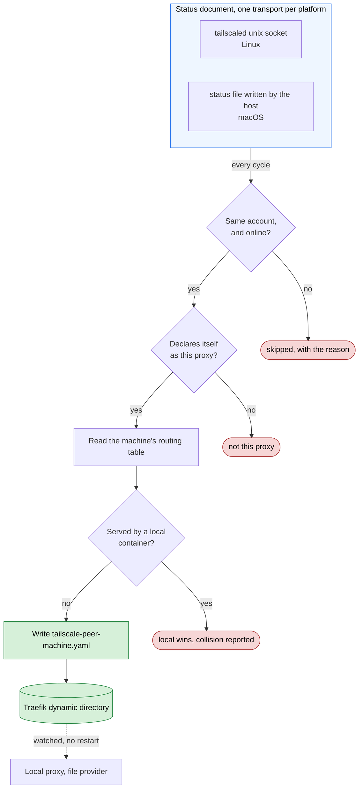

# AGENTS.md

Guidance for agentic coding agents working in this repository.

> `CLAUDE.md` is a symlink to this file. Both Claude Code and other agentic
> harnesses read the same content — edit `AGENTS.md` only.

> **Using this proxy in another project?** A dedicated `spark-http-proxy` agent
> skill covers exposing containers, certificates, DNS, and troubleshooting:
> [sparkfabrik/sf-agents-harness → skills/system/spark-http-proxy](https://github.com/sparkfabrik/sf-agents-harness/tree/main/skills/system/spark-http-proxy).
> This `AGENTS.md` is for working **on** the proxy's own source; the skill is for
> **using** the proxy from a consumer project.

## Repository Overview

Spark HTTP Proxy is a local development reverse proxy built on Traefik. It consists of:

- **`bin/spark-http-proxy`** — Bash CLI wrapper (the user-facing tool)
- **`cmd/`** — Go binaries: `dns-server`, `dinghy-layer`, `join-networks`, `tailscale-peers`
- **`pkg/`** — Shared Go packages (`config`, `logger`, `service`, `utils`)
- **`build/`** — Dockerfiles for each service (traefik, prometheus, grafana, services)
- **`bin/compose.yml`** — Production compose (GHCR pre-built images)
- **`compose.yml`** — Development compose (builds from source)
- **`test/`** — Docker-based integration tests (`test.sh`); unit tests live
  beside the code in `cmd/` and `pkg/`

## Architecture: the big picture

The novel part is not Traefik itself but the four sidecar Go binaries that feed
and surround it. Understanding their interaction requires reading across `cmd/`,
`pkg/`, `compose.yml`, and `build/traefik/`.

### The five runtime services (see `compose.yml`)

1. **`traefik`** (container name `http-proxy`) — the actual proxy. Runs with
   `exposedByDefault: false` (`build/traefik/traefik.yml`), so it ignores every
   container unless explicitly opted in via `traefik.*` labels or a generated
   dynamic-config file. Ports 80/443 public, 30000→8080 dashboard.
2. **`dinghy_layer`** (`cmd/dinghy-layer`) — the compatibility translator.
   Watches Docker events, reads `VIRTUAL_HOST`/`VIRTUAL_PORT`/`VIRTUAL_PATH`
   env vars on containers, and **writes Traefik dynamic YAML config files** into
   the shared `traefik_dynamic` volume. This is how nginx-proxy/jwilder-style
   containers work without native Traefik labels. `VIRTUAL_PATH` mounts a
   container under a path of its `VIRTUAL_HOST`, so two containers can share one
   domain; those routers carry an explicit `priority` while host-only routers
   deliberately do not, keeping their existing rule-length ordering untouched.
3. **`join_networks`** (`cmd/join-networks`) — the connectivity glue. Traefik
   can only route to containers on networks it has joined. This watches Docker
   events and **connects the `http-proxy` container to any Docker network that
   holds a manageable container**. Without it, routes resolve but traffic can't
   reach the backend. See `docs/network-joining-flow.md`.
4. **`tailscale_peers`** (`cmd/tailscale-peers`) — the cross-machine layer, and
   the only optional one: it runs behind the `tailscale` compose profile and does
   nothing unless `HTTP_PROXY_TAILSCALE_ENABLED=true`. It reads the tailnet
   status document from a source (`pkg/tailscale`: the daemon's unix socket, or a
   file the host writes on macOS), probes each machine of the same account for
   its routing table over the Traefik API on port 30000 (`pkg/traefikapi`), and
   **writes `tailscale-peer-*.yaml` into the same `traefik_dynamic` volume**,
   forwarding a hostname no local container serves to the machine that serves it.
   The same-user check lives in `pkg/tailscale` alone and reads no configuration,
   which is what keeps it from depending on the platform. See the
   **Tailnet peer routing** section below.
5. **`dns`** (`cmd/dns-server`) — built on `github.com/miekg/dns`. Resolves
   configured TLDs/domains (default `*.loc`) to `127.0.0.1` so no `/etc/hosts`
   editing is needed. Optionally forwards non-matching queries upstream.
   Listens on UDP+TCP 19322.

### The dynamic-config data flow (the key mechanism)

```
container with VIRTUAL_HOST  ─┐
                              ├─► dinghy_layer ──writes──► traefik_dynamic volume ──watched by──► traefik ──routes──► container
container with traefik.* labels ─────────────────────────(read directly by Docker provider)──────►
                              join_networks ──connects http-proxy to the container's network──►
```

Two independent paths produce Traefik routes: native `traefik.*` labels (read
directly by Traefik's Docker provider) and `VIRTUAL_HOST` env vars (translated
by `dinghy_layer` into files). Both require `join_networks` to have bridged the
network first.

### Shared Go packages (`pkg/`)

- **`pkg/config`** — env-var loading (`config.go`, all `HTTP_PROXY_DNS_*` vars
  with defaults) **and** the Traefik dynamic-config YAML structs (`traefik.go`:
  `TraefikConfig`/`Router`/`Service`/`TLSConfig`). `dinghy_layer` marshals these
  structs to produce the files Traefik watches.
- **`pkg/service`** — `docker_event_service.go`: the shared Docker-event-watching
  loop (`EventHandler` interface, `RunWithSignalHandling`). Both `dinghy_layer`
  and `join_networks` are `EventHandler` implementations on top of this. Performs
  an initial full scan, then streams events with signal-based graceful shutdown.
- **`pkg/logger`**, **`pkg/utils`** — leveled logging (`LOG_LEVEL`) and helpers.

All four binaries build from the **same `build/Dockerfile`** (multi-stage) and
are selected at runtime by their `command:` in compose.

### Configuration surface

Runtime behaviour is driven by env vars (mostly `HTTP_PROXY_DNS_*` and
`LOG_LEVEL`), defaulted in `pkg/config/config.go` and wired through
`compose.yml`. Per-container routing is driven by
`VIRTUAL_HOST`/`VIRTUAL_PORT`/`VIRTUAL_PATH` or `traefik.*` labels. When adding
an env var, update `pkg/config/config.go`, `compose.yml`, `README.md`, and
`examples/applications.yml` together.

Note that **any** `traefik.` label on a container makes `dinghy_layer` skip it
entirely, `VIRTUAL_HOST` included. That is intentional (native labels win) but
easy to trip over by adding a middleware label alone, so the layer now warns
when it happens.

## Tailnet peer routing

Off by default, and the pieces are spread across the tree, so the constraints are
worth knowing before touching any of them.



**Reading the diagram.** One arrow leaves the sources group because either
transport feeds the same filter: the platform decides how the document arrives,
never what it is checked against. Diamonds are decisions, the three red terminals
are the three statuses `tailscale-peers` reports, and green is what gets written.
The dotted edge is where this service stops and Traefik takes over, watching the
directory with no restart. The request path that reads what this writes is in the
README.

**The ownership filter is the trust boundary.** `Status.Peers` in
`pkg/tailscale/status.go` accepts a machine only when its `UserID` matches
`Self.UserID`. That package reads no environment at all, deliberately: no setting
can reach the filter. Three tests guard it, and a change that makes ownership
configurable is a change to the capability, not an implementation detail.

**A source produces a document; everything downstream is shared.** Adding a
platform means adding a `tailscale.Source`, never a second filter. A source that
cannot produce a document contributes nothing that cycle: an unreachable daemon
and an empty tailnet are different states and are reported differently.

**A machine is adopted only if it declares itself.** `build/traefik/entrypoint.sh`
writes `spark-http-proxy-declaration.yaml`, a middleware named
`traefikapi.ProxyDeclarationName` that no router references, so it changes no
routing on the machine that publishes it. `Client.Declares` is asked before the
routing table, so a machine that is not this proxy costs one request. The check
fails closed, which means **both machines need this version before anything is
forwarded**. The declaration is written unconditionally, including when peer
routing is disabled: it says what the proxy is, not what it does. Its name must
stay outside the `tailscale-peer-*.yaml` glob, or disabling forwarding on a
machine would also make it undiscoverable by everyone else.

**A peer rule is copied verbatim, so it has to be constrained.** `Routes` in
`pkg/traefikapi` refuses a rule unless every top-level alternative names a host
it is not negating: `Host(`peer.loc`) || PathPrefix(`/`)` would otherwise become
a local router matching every request, and hostname extraction sees only
`peer.loc`, so local precedence would never recognise the shadowing as a
collision. A rule that does not parse confidently is refused for the same reason.
Refusals are logged and reported rather than dropped silently.

**File ownership in the dynamic directory is scoped by prefix.**
`tailscale-peers` removes only `tailscale-peer-*.yaml` and `dinghy-layer` removes
only `^[0-9a-f]{12}\.yaml$`, so neither can delete the other's files or the
entrypoint's `auto-tls.yml`. That prefix is also the loop guard read back from
peers (`traefikapi.PeerRouterPrefix`) and the glob the Traefik entrypoint clears
when the behaviour is disabled. **All three move together.**

**Disabling has to actually disable.** With the profile off the service never
starts, so nothing would clear the files it left behind. The entrypoint removes
them at startup unless `HTTP_PROXY_TAILSCALE_ENABLED=true`, which is why the
Traefik service receives that variable. Startup is too late for `stop-tailscale`,
so the service also withdraws its own routes as it shuts down: stopping peer
routing must stop forwarding without a proxy restart.

**The three timing values are independent on purpose.** The refresh interval
(60 seconds) paces the cycle, `HTTP_PROXY_TAILSCALE_STATUS_MAX_AGE` (10 minutes)
bounds how stale a host-written ownership document may be, and the probe backoff
ceiling (15 minutes) bounds how long a failing machine goes unprobed. The
staleness tolerance was once derived from the interval, which meant slowing the
poll silently loosened a trust input. Keep them separate, and have tests drive
the interval explicitly rather than inheriting the default.

**The compose socket mount lives in `compose.tailscale-socket.yml`.** A platform
without a daemon socket has no path to mount, and a bind mount of a missing path
gets a directory created for it. `bin/spark-http-proxy` passes that file only
when the source is `socket`, and builds its compose invocation as the
`COMPOSE_FILES` array; `COMPOSE_FILE` stays a single path because Compose reads
it as a `:`-separated list.

**The state directory is a trust input**, not a scratch area: the document in it
decides where traffic goes. It is created `0700` and the status document `0600`.

**The command line reports, it does not discover.** The service renders its own
report next to the state file (`Report.Render`), and `spark-http-proxy
tailscale-peers` prints it. Keep it that way: a formatter in shell would be a
second implementation of what a peer contributed, and would need a JSON parser
this project does not depend on.

**The integration test uses the file source with a synthetic status document**,
so the ownership filter runs during the test instead of being bypassed by it. A
second Traefik inside the stack stands in for a second machine, with its own
static config listening on port 30000, since inside the stack there is no host
port mapping. Build with the profile active: `docker compose build` skips
profile-gated services, so a plain build leaves `tailscale_peers` on a stale
image and the suite silently tests old code.

## Build Commands

```bash
make build                  # Build the Go binaries
make build-go-dns           # Build cmd/dns-server only
make build-go-dinghy-layer  # Build cmd/dinghy-layer only
make build-go-join-networks # Build cmd/join-networks only
make clean                  # Remove build artifacts from cmd/*/
go build ./...              # Quick compilation check (no output binaries)
go mod tidy                 # Clean up go.mod / go.sum
```

After building binaries for manual testing, **remove them** before committing:

```bash
rm -f cmd/dns-server/dns-server cmd/dinghy-layer/dinghy-layer cmd/join-networks/join-networks
```

## Test Commands

Two suites. Unit tests sit beside the code as `_test.go` files; the integration
suite is a single shell script that runs the real stack in Docker.

```bash
go test ./...                   # Unit tests — fast, no Docker
make test                       # Full rebuild + integration tests (NOT unit tests)
./test/test.sh --no-rebuild     # Run integration tests against a running stack (faster)
./test/test.sh --help           # Show test options
docker compose config           # Validate compose file syntax
```

`make test` runs the integration suite only, so run `go test ./...` as well
before pushing. CI runs both.

Tests require:

- Docker daemon running
- Ports 80, 443, 19322 available
- `dig` and `curl` installed (for DNS and HTTP assertions)

There is no way to run a single test in isolation — `test/test.sh` is a monolithic shell script. To iterate on a specific area, use `--no-rebuild` and comment out unrelated test sections temporarily.

## Development Environment

```bash
make dev-up             # Start full dev stack (builds from source, basic stack)
make dev-up-metrics     # Start dev stack with Prometheus + Grafana
make dev-down           # Stop dev stack and remove volumes
make dev-cli-traefik    # Open a shell in the Traefik container
```

The dev stack uses `compose.yml` (root) with `build:` contexts. The production stack
uses `bin/compose.yml` with pre-built GHCR images.

## Lint and Format

```bash
gofmt -l ./cmd ./pkg        # List files needing formatting
gofmt -w ./cmd ./pkg        # Format in place
go vet ./...                # Check for suspicious constructs
goimports -w ./cmd ./pkg    # Fix imports (install: go install golang.org/x/tools/cmd/goimports@latest)
```

No linter config file exists. Use `golangci-lint` if available, otherwise `go vet` is the baseline.
CI runs `make test` and a Trivy security scan — no separate lint step in CI.

## Go Code Style

Source: `.github/instructions/go.instructions.md` (Effective Go + Google Go Style).

- Format with `gofmt` / `goimports` always — no exceptions
- Use `camelCase` for unexported, `PascalCase` for exported names
- Package names: lowercase, single word, no underscores (e.g. `config`, `logger`)
- Interface names use `-er` suffix when possible (`Reader`, `Writer`)
- Keep the happy path left-aligned; return early to reduce nesting
- Error handling: check immediately, wrap with `fmt.Errorf("context: %w", err)`, never
  log and return — choose one
- Error messages: lowercase, no trailing punctuation
- Place `main` packages in `cmd/`, shared code in `pkg/`
- Keep interfaces small (1–3 methods); define them near the consumer, not the implementor
- Accept interfaces, return concrete types
- Use `defer` for cleanup; always know how a goroutine will exit
- After any implementation, run `make test` to verify nothing is broken

## Bash Script Style (`bin/spark-http-proxy`)

The CLI is a single Bash script. Follow the conventions already established in it:

- `set -e` at the top — every new function must be safe to run under errexit
- Logging via the four helpers: `log_info`, `log_success`, `log_error`, `log_warning`
- Local variables declared with `local` at the top of every function
- Docker Compose via `dc_cmd` and `dc_metrics` helpers — never call `docker compose` directly
- Use `docker compose` (plugin form), never the legacy `docker-compose`
- New commands must be added in **all four places**:
  1. Function definition (before `show_version`)
  2. `case` dispatch block (before the `*` catch-all)
  3. `show_usage` help text
  4. `generate_completion` commands string
- Commands that do not need Docker (e.g. pure git or config ops) must be added to the
  prerequisite skip list near line 326

## Docker / Dockerfile Style

Source: `.github/instructions/docker.instructions.md`

- Use multi-stage builds (see `build/Dockerfile` as the reference)
- Use specific base image versions — never `latest` in Dockerfiles
- Use minimal base images (`alpine`, `distroless`)
- Run containers as non-root users where possible
- Use `COPY` over `ADD` unless `ADD` features are needed
- Set explicit `WORKDIR`
- Use `docker compose` (not `docker-compose`) in all scripts and Make targets

## Makefile Style

Source: `.github/instructions/makefile.instructions.md`

- All targets in `.PHONY` if they don't produce files
- Every target has a `## Description` comment for the `help` target
- `UPPERCASE` for variable names
- Group related targets logically (build, dev, test, clean)

## Changelog

- Keep `CHANGELOG.md` updated for every user-visible change
- Format follows [Keep a Changelog](https://keepachangelog.com/en/1.0.0/)
- Add entries under `[Unreleased]` in the appropriate section (`Added`, `Fixed`, `Changed`)
- Link entries to the relevant PR: `([#N](https://github.com/sparkfabrik/http-proxy/pull/N))`

## General Guidelines

Source: `.github/instructions/general-coding.instructions.md`

- Never commit secrets or API keys; use environment variables for configuration
- Update `README.md` when adding new features or environment variables
- Document new env vars in both `README.md` and `examples/applications.yml`
- Keep functions small and focused on a single responsibility
- CI runs on every push; `main` branch pushes trigger image builds to GHCR
- Images are published to `ghcr.io/sparkfabrik/http-proxy-{traefik,services,prometheus,grafana}`
- Multi-arch builds target `linux/amd64` and `linux/arm64`
