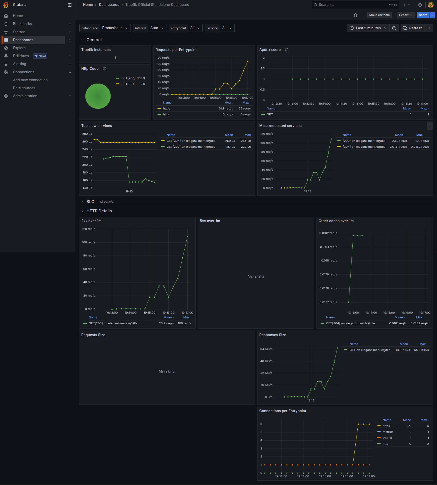
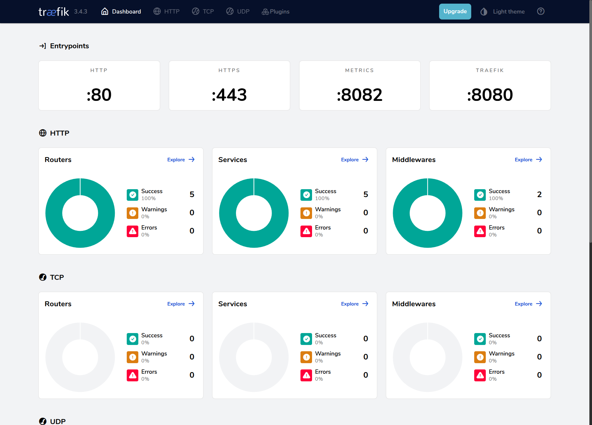

# Spark HTTP Proxy

[](https://ghcr.io/sparkfabrik/http-proxy)
[](https://github.com/sparkfabrik/http-proxy/actions/workflows/ci.yml)

**Automatic HTTP routing for Docker containers** — A Traefik-based proxy that gives your containers clean domain names like `myapp.local` instead of dealing with `localhost:8080` port chaos.

Simply add `VIRTUAL_HOST=myapp.local` to any container or use native Traefik labels, and your applications become accessible with both HTTP and HTTPS automatically. No port management, no `/etc/hosts` editing, no hunting for the right port number. **Only explicitly configured containers are exposed**, keeping your development environment secure by default.

## Table of Contents

- [Features](#features)
- [Quick Start](#quick-start)
  - [Optional Commands](#optional-commands)
- [Container Configuration](#container-configuration)
  - [Supported Patterns](#supported-patterns)
- [Container Management](#container-management)
- [Network Management](#network-management)
- [DNS Server](#dns-server)
  - [DNS Configuration](#dns-configuration)
  - [DNS Usage Patterns](#dns-usage-patterns)
    - [TLD Support (Recommended)](#tld-support-recommended)
    - [Multiple TLDs](#multiple-tlds)
    - [Specific Domains](#specific-domains)
- [Advanced Configuration with Traefik Labels](#advanced-configuration-with-traefik-labels)
  - [Basic Traefik Labels Example](#basic-traefik-labels-example)
  - [Traefik Labels Breakdown](#traefik-labels-breakdown)
  - [Understanding Traefik Core Concepts](#understanding-traefik-core-concepts)
    - [Entrypoints - The "Front Door"](#entrypoints---the-front-door)
    - [Load Balancer - The "Traffic Director"](#load-balancer---the-traffic-director)
    - [The Complete Flow](#the-complete-flow)
    - [Advanced Load Balancer Features](#advanced-load-balancer-features)
    - [Why This Architecture Matters](#why-this-architecture-matters)
- [HTTPS Support](#https-support)
  - [Automatic HTTP and HTTPS Routes](#automatic-http-and-https-routes)
  - [Self-Signed Certificates](#self-signed-certificates)
  - [Trusted Local Certificates with mkcert](#trusted-local-certificates-with-mkcert)
    - [Manual Certificate Generation (Alternative)](#manual-certificate-generation-alternative)
    - [Start the proxy](#start-the-proxy)
    - [How Certificate Matching Works](#how-certificate-matching-works)
  - [Using Traefik Labels Instead of VIRTUAL_HOST](#using-traefik-labels-instead-of-virtual_host)
- [Dinghy Layer Compatibility](#dinghy-layer-compatibility)
  - [Supported Environment Variables](#supported-environment-variables)
  - [Migration Notes](#migration-notes)
- [DNS Server](#dns-server-1)
  - [DNS Configuration](#dns-configuration-1)
  - [DNS Usage Patterns](#dns-usage-patterns-1)
    - [TLD Support (Recommended)](#tld-support-recommended-1)
    - [Multiple TLDs](#multiple-tlds-1)
    - [Specific Domains](#specific-domains-1)
  - [System DNS Configuration](#system-dns-configuration)
    - [Linux (systemd-resolved)](#linux-systemd-resolved)
    - [macOS](#macos)
    - [Manual Testing](#manual-testing)
- [Metrics & Monitoring](#metrics--monitoring)
  - [Grafana Dashboard](#grafana-dashboard)
  - [Traefik Dashboard](#traefik-dashboard)

## Features

- 🚀 **Automatic Container Discovery** - Zero-configuration HTTP routing for containers with `VIRTUAL_HOST` environment variables or Traefik labels
- 🌐 **Built-in DNS Server** - Resolves custom domains (`.loc`, `.dev`, etc.) to localhost, eliminating manual `/etc/hosts` editing
- 🌍 **Dynamic Network Management** - Automatically joins Docker networks containing manageable containers for seamless routing
- 🔐 **Automatic HTTPS Support** - Provides both HTTP and HTTPS routes with auto-generated certificates and mkcert integration for trusted local certificates
- 📊 **Monitoring Ready** - Optional Prometheus metrics and Grafana dashboards for traffic monitoring and performance analysis

> **Note**: We thank the [codekitchen/dinghy-http-proxy](https://github.com/codekitchen/dinghy-http-proxy) project for the inspiration and for serving us well over the years. Spark HTTP Proxy includes a compatibility layer that supports the `VIRTUAL_HOST` and `VIRTUAL_PORT` environment variables from the original project, while providing enhanced functionality for broader use cases and improved maintainability.

## Quick Start

```bash
# Install Spark HTTP Proxy
mkdir -p ${HOME}/.local/spark/http-proxy
git clone git@github.com:sparkfabrik/http-proxy.git ${HOME}/.local/spark/http-proxy/src
sudo ln -s ${HOME}/.local/spark/http-proxy/src/bin/spark-http-proxy /usr/local/bin/spark-http-proxy
sudo chmod +x /usr/local/bin/spark-http-proxy
spark-http-proxy install-completion

# Or alternatively if you like to live on the edge.
bash <(curl -fsSL https://raw.githubusercontent.com/sparkfabrik/http-proxy/main/bin/install.sh)

# Start the HTTP proxy
spark-http-proxy start

# Generate trusted SSL certificates for your domains
spark-http-proxy generate-mkcert "*.spark.loc"

# Generate certificates for additional patterns if needed  
spark-http-proxy generate-mkcert "*.local"     # For .local domains
spark-http-proxy generate-mkcert "myapp.dev"   # For specific domains
spark-http-proxy generate-mkcert "*.api.loc"   # For multi-level wildcards

# The generate-mkcert command automatically:
# - Installs mkcert if not already available  
# - Creates the certificate directory (~/.local/spark/http-proxy/certs)
# - Generates certificates with safe filenames for wildcard domains
# - Restarts Traefik to load the new certificates immediately

# Test with containers (multiple options)

# Option 1: Simple docker run command
docker run -d -e VIRTUAL_HOST=test.spark.loc nginx

# Option 2: Using docker-compose for more complex setups
cat > demo-app.yml << EOF
services:
  web:
    image: nginx:alpine
    environment:
      - VIRTUAL_HOST=myapp.spark.loc
      - VIRTUAL_PORT=80  # Optional: defaults to exposed port
  
  api:
    image: traefik/whoami:latest
    environment:
      - VIRTUAL_HOST=api.spark.loc,api-alt.spark.loc  # Multiple domains
  
  database-admin:
    image: adminer:latest
    environment:
      - VIRTUAL_HOST=db.spark.loc
      - VIRTUAL_PORT=8080

# Connect to the proxy network so containers can be discovered  
networks:
  default:
    name: http-proxy_default
    external: true
EOF

docker compose -f demo-app.yml up -d

# Access your apps with HTTPS
curl https://test.spark.loc          # Single container
curl https://myapp.spark.loc         # Web app
curl https://api.spark.loc           # API service  
curl https://api-alt.spark.loc       # Same API with different domain
curl https://db.spark.loc            # Database admin interface
```

**That's it!** 🎉 All your containers are now accessible with trusted HTTPS certificates:

- ✅ `https://test.spark.loc` - Simple nginx container
- ✅ `https://myapp.spark.loc` - Web application  
- ✅ `https://api.spark.loc` - API service
- ✅ `https://db.spark.loc` - Database admin interface

### Container Configuration Patterns

The examples above demonstrate different ways to configure containers:

**Environment Variables (recommended for simple setups):**
- `VIRTUAL_HOST=myapp.loc` - Single domain
- `VIRTUAL_HOST=app.loc,api.loc` - Multiple domains  
- `VIRTUAL_HOST=*.myapp.loc` - Wildcard domains
- `VIRTUAL_HOST=~^api\\..*\\.loc$` - Regex patterns for advanced matching
- `VIRTUAL_PORT=8080` - Custom port (defaults to exposed port or 80)

**Automatic Features:**
- **HTTP + HTTPS**: Both protocols are automatically available for all `VIRTUAL_HOST` domains
- **Network Discovery**: Containers are automatically discovered across Docker networks
- **Certificate Matching**: Wildcard certificates (like `*.spark.loc`) automatically work for all subdomains
- **Security**: Only containers with `VIRTUAL_HOST` or `traefik.*` labels are exposed

### Cleanup Demo

When you're done testing, clean up the demo containers:

```bash
# Remove demo containers
docker compose -f demo-app.yml down
docker stop $(docker ps -q --filter "label=com.docker.compose.project=http-proxy")
rm demo-app.yml

# Optionally stop the proxy
spark-http-proxy stop
```

### DNS and Monitoring (Recommended)

```bash
# Configure system DNS (eliminates need for manual /etc/hosts editing)
spark-http-proxy configure-dns

# View status and dashboard  
spark-http-proxy status

# Start with monitoring (Prometheus + Grafana) 
spark-http-proxy start-with-metrics
```

**💡 Pro tip**: Use `spark-http-proxy configure-dns` to automatically resolve `.loc` domains without editing `/etc/hosts`. This makes the container examples above work immediately without any manual DNS configuration!

For more examples and advanced configurations, check the `examples/` directory.

## Container Configuration

**Important**: Only containers with explicit configuration are automatically managed by the proxy. Containers without `VIRTUAL_HOST` environment variables or `traefik.*` labels are ignored to ensure security and prevent unintended exposure.

### Advanced Configuration Examples

For more complex scenarios beyond the Quick Start examples:

```yaml
# docker-compose.yml
services:
  myapp:
    image: nginx:alpine
    environment:
      - VIRTUAL_HOST=myapp.local # Required: your custom domain
      - VIRTUAL_PORT=8080 # Optional: defaults to exposed port or 80
    expose:
      - "8080"
```

### Supported Patterns

- **Single domain**: `VIRTUAL_HOST=myapp.local`
- **Multiple domains**: `VIRTUAL_HOST=app.local,api.local`
- **Wildcards**: `VIRTUAL_HOST=*.myapp.local`
- **Regex patterns**: `VIRTUAL_HOST=~^api\\..*\\.local$`

## Container Management

The proxy uses **opt-in container discovery** (`exposedByDefault: false`). Only containers with explicit configuration are managed:

- **Dinghy**: Containers with `VIRTUAL_HOST=domain.local` environment variable
- **Traefik**: Containers with labels starting with `traefik.*`

Unmanaged containers are ignored and never exposed.

## Network Management

The proxy automatically joins Docker networks that contain manageable containers, enabling seamless routing without manual network configuration. This process is handled by the `join-networks` service.

📖 **[Detailed Network Joining Flow Documentation](docs/network-joining-flow.md)** - Complete technical documentation with flow diagrams explaining how automatic network discovery and joining works.

## DNS Server

The HTTP proxy includes a **built-in DNS server** that automatically resolves configured domains to localhost, eliminating the need to manually edit `/etc/hosts` or configure system DNS.

### DNS Configuration

The DNS server supports both **Top-Level Domains (TLDs)** and **specific domains**:

```yaml
# docker-compose.yml
services:
  dns:
    environment:
      # Configure which domains to handle (comma-separated)
      - HTTP_PROXY_DNS_TLDS=loc,dev # Handle any *.loc and *.dev domains
      - HTTP_PROXY_DNS_TLDS=spark.loc,api.dev # Handle only specific domains
      - HTTP_PROXY_DNS_TLDS=loc # Handle any *.loc domains (default)

      # Where to resolve domains (default: 127.0.0.1)
      - HTTP_PROXY_DNS_TARGET_IP=127.0.0.1

      # DNS server port (default: 19322)
      - HTTP_PROXY_DNS_PORT=19322
```

### DNS Usage Patterns

#### TLD Support (Recommended)

Configure TLDs to handle any subdomain automatically:

```bash
# Environment: HTTP_PROXY_DNS_TLDS=loc
✅ myapp.loc → 127.0.0.1
✅ api.loc → 127.0.0.1
✅ anything.loc → 127.0.0.1
❌ myapp.dev → Not handled
```

#### Multiple TLDs

Support multiple development TLDs:

```bash
# Environment: HTTP_PROXY_DNS_TLDS=loc,dev,docker
✅ myapp.loc → 127.0.0.1
✅ api.dev → 127.0.0.1
✅ service.docker → 127.0.0.1
```

#### Specific Domains

Handle only specific domains for precise control:

```bash
# Environment: HTTP_PROXY_DNS_TLDS=spark.loc,api.dev
✅ spark.loc → 127.0.0.1
✅ api.dev → 127.0.0.1
❌ other.loc → Not handled
❌ different.dev → Not handled
```

## Advanced Configuration with Traefik Labels

While `VIRTUAL_HOST` environment variables provide simple automatic routing, you can also use **Traefik labels** for more advanced configuration. Both methods work together seamlessly.

### Basic Traefik Labels Example

```yaml
services:
  myapp:
    image: nginx:alpine
    labels:
      # Define the routing rule - which domain/path routes to this service
      - "traefik.http.routers.myapp.rule=Host(`myapp.docker`)"

      # Specify which entrypoint to use (http = port 80)
      - "traefik.http.routers.myapp.entrypoints=http"

      # Set the target port for load balancing
      - "traefik.http.services.myapp.loadbalancer.server.port=80"
```

> **Note**: `traefik.enable=true` is **not required** since auto-discovery is always enabled in this proxy.

### Traefik Labels Breakdown

| Label            | Purpose                                      | Example                                                     |
| ---------------- | -------------------------------------------- | ----------------------------------------------------------- |
| **Router Rule**  | Defines which requests route to this service | `traefik.http.routers.myapp.rule=Host(\`myapp.docker\`)`    |
| **Entrypoints**  | Which proxy port to listen on                | `traefik.http.routers.myapp.entrypoints=http`               |
| **Service Port** | Target port on the container                 | `traefik.http.services.myapp.loadbalancer.server.port=8080` |

### Understanding Traefik Core Concepts

To effectively use Traefik labels, it helps to understand the key concepts:

#### **Entrypoints** - The "Front Door"

An **entrypoint** is where Traefik listens for incoming traffic. Think of it as the "front door" of your proxy.

```yaml
# In our Traefik configuration:
entrypoints:
  http: # ← This is just a custom name! You can call it anything
    address: ":80" # Listen on port 80 for HTTP traffic
  websecure: # ← Another custom name
    address: ":443" # Listen on port 443 for HTTPS traffic (if configured)
  api: # ← You could even call it "api" or "http" or "frontend"
    address: ":8080" # Listen on port 8080
```

**Important**: `http` is just a **custom name** that we chose. You could name your entrypoints anything:

- `http`, `https`, `frontend`, `api`, `public` - whatever makes sense to you!

When you specify `traefik.http.routers.myapp.entrypoints=http`, you're telling Traefik:

> _"Route requests that come through the entrypoint named 'http' (which happens to be port 80) to my application"_

The entrypoint name must match between:

1. **Traefik configuration** (where you define `web: address: ":80"`)
2. **Container labels** (where you reference `entrypoints=web`)

#### **Load Balancer** - The "Traffic Director"

The **load balancer** determines how traffic gets distributed to your actual application containers.

```yaml
# This label creates a load balancer configuration:
- "traefik.http.services.myapp.loadbalancer.server.port=8080"
```

This tells Traefik:

> _"When routing to this service, send traffic to port 8080 on the container"_

#### **The Complete Flow**

Here's how a request flows through Traefik:

```
1. [Browser] → http://myapp.docker
                    ↓
2. [Entrypoint :80] ← "web" entrypoint receives the request
                    ↓
3. [Router] ← Checks rule: Host(`myapp.docker`) ✓ Match!
                    ↓
4. [Service] ← Routes to the configured service
                    ↓
5. [Load Balancer] ← Forwards to container port 8080
                    ↓
6. [Container] ← Your app receives the request
```

#### **Advanced Load Balancer Features**

While we typically use simple port mapping, Traefik's load balancer supports much more:

```yaml
services:
  # Multiple container instances (automatic load balancing)
  web-app:
    image: nginx:alpine
    deploy:
      replicas: 3 # 3 instances of the same app
    labels:
      - "traefik.http.routers.webapp.rule=Host(`webapp.docker`)"
      - "traefik.http.routers.webapp.entrypoints=web"
      # Traefik automatically balances between all 3 instances!

  # Health check configuration
  api-service:
    image: myapi:latest
    labels:
      - "traefik.http.routers.api.rule=Host(`api.docker`)"
      - "traefik.http.routers.api.entrypoints=web"
      - "traefik.http.services.api.loadbalancer.server.port=3000"
      # Configure health checks
      - "traefik.http.services.api.loadbalancer.healthcheck.path=/health"
      - "traefik.http.services.api.loadbalancer.healthcheck.interval=30s"
```

#### **Why This Architecture Matters**

This separation of concerns provides powerful flexibility:

- **Entrypoints**: Control _where_ Traefik listens (ports, protocols)
- **Routers**: Control _which_ requests go _where_ (domains, paths, headers)
- **Services**: Control _how_ traffic reaches your apps (ports, health checks, load balancing)

Example of advanced routing:

```yaml
services:
  # Same app, different routing based on subdomain
  app-v1:
    image: myapp:v1
    labels:
      - "traefik.http.routers.app-v1.rule=Host(`v1.myapp.docker`)"
      - "traefik.http.routers.app-v1.entrypoints=web"
      - "traefik.http.services.app-v1.loadbalancer.server.port=8080"

  app-v2:
    image: myapp:v2
    labels:
      - "traefik.http.routers.app-v2.rule=Host(`v2.myapp.docker`)"
      - "traefik.http.routers.app-v2.entrypoints=web"
      - "traefik.http.services.app-v2.loadbalancer.server.port=8080"

  # Route 90% traffic to v1, 10% to v2 (canary deployment)
  app-main:
    image: myapp:v1
    labels:
      - "traefik.http.routers.app-main.rule=Host(`myapp.docker`)"
      - "traefik.http.routers.app-main.entrypoints=web"
      - "traefik.http.services.app-main.loadbalancer.server.port=8080"
      # Weight-based routing (advanced feature)
      - "traefik.http.services.app-main.loadbalancer.server.weight=90"
```

## HTTPS Support

The proxy automatically exposes both HTTP and HTTPS for all applications configured with `VIRTUAL_HOST`. Both protocols are available without any additional configuration.

### Automatic HTTP and HTTPS Routes

When you set `VIRTUAL_HOST=myapp.local`, you automatically get:

- **HTTP**: `http://myapp.local` (port 80)
- **HTTPS**: `https://myapp.local` (port 443)

```yaml
services:
  myapp:
    image: nginx:alpine
    environment:
      - VIRTUAL_HOST=myapp.local # Creates both HTTP and HTTPS routes automatically
```

### Self-Signed Certificates

Traefik automatically generates self-signed certificates for HTTPS routes. For trusted certificates in development, you can use mkcert to generate wildcard certificates.

### Trusted Local Certificates with mkcert

For browser-trusted certificates without warnings, use the `spark-http-proxy generate-mkcert` command. This command automatically handles the entire certificate generation process:

```bash
# Generate wildcard certificate for .loc domains
spark-http-proxy generate-mkcert "*.loc"

# Generate certificates for specific domains
spark-http-proxy generate-mkcert "myapp.local"

# For complex multi-level domains, generate additional certificates:
spark-http-proxy generate-mkcert "*.project.loc"
```

The `generate-mkcert` command automatically:
- **Installs mkcert** if not already available (using Homebrew on macOS)
- **Creates the certificate directory** (`~/.local/spark/http-proxy/certs`)
- **Generates certificates** with safe filenames for wildcard domains
- **Restarts Traefik** to load the new certificates immediately

#### Manual Certificate Generation (Alternative)

If you prefer to generate certificates manually using [mkcert](https://github.com/FiloSottile/mkcert) directly:

```bash
# Install the local CA
mkcert -install

# Create the certificates directory
mkdir -p ~/.local/spark/http-proxy/certs

# Generate wildcard certificate for .loc domains
mkcert -cert-file ~/.local/spark/http-proxy/certs/wildcard.loc.pem \
       -key-file ~/.local/spark/http-proxy/certs/wildcard.loc-key.pem \
       "*.loc"
```

**Note**: When using manual generation, you'll need to restart the proxy to load new certificates: `docker compose restart`

#### Start the proxy

The certificates will be automatically detected and loaded when you start the proxy:

```bash
docker compose up -d
```

The Traefik container's entrypoint script scans `~/.local/spark/http-proxy/certs/` for certificate files and automatically generates the TLS configuration in `/traefik/dynamic/auto-tls.yml`. You don't need to manually edit any configuration files!

Now your `.loc` domains will use trusted certificates! 🎉

✅ `https://myapp.loc` - Trusted
✅ `https://api.loc` - Trusted
✅ `https://project.loc` - Trusted

**Note**: The `*.loc` certificate covers single-level subdomains. For multi-level domains like `app.project.sparkfabrik.loc`, generate additional certificates as shown in the commented example above.

#### How Certificate Matching Works

Traefik automatically matches certificates to incoming HTTPS requests using **SNI (Server Name Indication)**:

1. **Certificate Detection**: The entrypoint script scans `/traefik/certs` and extracts domain information from each certificate's Subject Alternative Names (SAN)
2. **Automatic Matching**: When a browser requests `https://myapp.loc`, Traefik:

   - Receives the domain name via SNI
   - Looks through available certificates for one that matches `myapp.loc`
   - Finds the `*.loc` wildcard certificate and uses it
   - Serves the HTTPS response with the trusted certificate

3. **Wildcard Coverage**:

   - `*.loc` covers: `myapp.loc`, `api.loc`, `database.loc`
   - `*.loc` does NOT cover: `sub.myapp.loc`, `api.project.loc`
   - For multi-level domains, generate specific certificates like `*.project.loc`

4. **Fallback**: If no matching certificate is found, Traefik generates a self-signed certificate for that domain

You can see which domains each certificate covers in the container logs when it starts up.

### Using Traefik Labels Instead of VIRTUAL_HOST

If you prefer to use Traefik labels instead of `VIRTUAL_HOST`, you can achieve the same HTTP and HTTPS routes manually:

```yaml
services:
  myapp:
    image: nginx:alpine
    labels:
      # HTTP router
      - "traefik.http.routers.myapp.rule=Host(`myapp.local`)"
      - "traefik.http.routers.myapp.entrypoints=http"
      - "traefik.http.routers.myapp.service=myapp"

      # HTTPS router
      - "traefik.http.routers.myapp-tls.rule=Host(`myapp.local`)"
      - "traefik.http.routers.myapp-tls.entrypoints=https"
      - "traefik.http.routers.myapp-tls.tls=true"
      - "traefik.http.routers.myapp-tls.service=myapp"

      # Service configuration
      - "traefik.http.services.myapp.loadbalancer.server.port=80"
```

This manual approach gives you the same result as `VIRTUAL_HOST=myapp.local` but with more control over the configuration.

## Dinghy Layer Compatibility

This HTTP proxy provides compatibility with the original [dinghy-http-proxy](https://github.com/codekitchen/dinghy-http-proxy) environment variables:

### Supported Environment Variables

| Variable       | Support     | Description                      |
| -------------- | ----------- | -------------------------------- |
| `VIRTUAL_HOST` | ✅ **Full** | Automatic HTTP and HTTPS routing |
| `VIRTUAL_PORT` | ✅ **Full** | Backend port configuration       |

### Migration Notes

- **Security**: **`exposedByDefault: false`** ensures only containers with `VIRTUAL_HOST` or `traefik.*` labels are managed
- **HTTPS**: Unlike the original dinghy-http-proxy, HTTPS is automatically enabled for all `VIRTUAL_HOST` entries
- **Multiple domains**: Comma-separated domains in `VIRTUAL_HOST` work the same way
- **Container selection**: Unmanaged containers are completely ignored, preventing accidental exposure

## DNS Server

The HTTP proxy includes a **built-in DNS server** that automatically resolves configured domains to localhost, eliminating the need to manually edit `/etc/hosts` or configure system DNS.

### DNS Configuration

The DNS server supports both **Top-Level Domains (TLDs)** and **specific domains**:

```yaml
# docker-compose.yml
services:
  dns:
    environment:
      # Configure which domains to handle (comma-separated)
      - HTTP_PROXY_DNS_TLDS=loc,dev # Handle any *.loc and *.dev domains
      - HTTP_PROXY_DNS_TLDS=spark.loc,api.dev # Handle only specific domains
      - HTTP_PROXY_DNS_TLDS=loc # Handle any *.loc domains (default)

      # Where to resolve domains (default: 127.0.0.1)
      - HTTP_PROXY_DNS_TARGET_IP=127.0.0.1

      # DNS server port (default: 19322)
      - HTTP_PROXY_DNS_PORT=19322
```

### DNS Usage Patterns

#### TLD Support (Recommended)

Configure TLDs to handle any subdomain automatically:

```bash
# Environment: HTTP_PROXY_DNS_TLDS=loc
✅ myapp.loc → 127.0.0.1
✅ api.loc → 127.0.0.1
✅ anything.loc → 127.0.0.1
❌ myapp.dev → Not handled
```

#### Multiple TLDs

Support multiple development TLDs:

```bash
# Environment: HTTP_PROXY_DNS_TLDS=loc,dev,docker
✅ myapp.loc → 127.0.0.1
✅ api.dev → 127.0.0.1
✅ service.docker → 127.0.0.1
```

#### Specific Domains

Handle only specific domains for precise control:

```bash
# Environment: HTTP_PROXY_DNS_TLDS=spark.loc,api.dev
✅ spark.loc → 127.0.0.1
✅ api.dev → 127.0.0.1
❌ other.loc → Not handled
❌ different.dev → Not handled
```

### System DNS Configuration

To use the built-in DNS server, configure your system to use it for domain resolution:

#### Linux (systemd-resolved)

```bash
# Configure systemd-resolved to use http-proxy DNS for .loc domains
sudo mkdir -p /etc/systemd/resolved.conf.d
sudo tee /etc/systemd/resolved.conf.d/http-proxy.conf > /dev/null <<EOF
[Resolve]
DNS=172.17.0.1:19322
Domains=~loc
EOF

# Restart systemd-resolved to apply changes
sudo systemctl restart systemd-resolved

# Verify configuration
systemd-resolve --status
```

**⚠️ Known Limitation**: systemd-resolved may route some external domain queries to the HTTP proxy DNS server, resulting in `REFUSED` responses in the logs. This doesn't affect functionality - external domains resolve through fallback mechanisms. **Solutions:**

- **Accept current behavior** (recommended): The `REFUSED` responses are correct and harmless
- **See [systemd-resolved limitations documentation](docs/linux-systemd-resolved-issues.md)** for details

#### macOS

```bash
# Configure specific domains (recommended)
sudo mkdir -p /etc/resolver
echo "nameserver 127.0.0.1" | sudo tee /etc/resolver/loc
echo "port 19322" | sudo tee -a /etc/resolver/loc
```

#### Manual Testing

You can test DNS resolution manually without system configuration:

```bash
# Test with dig
dig @127.0.0.1 -p 19322 myapp.loc

# Test with nslookup
nslookup myapp.loc 127.0.0.1 19322

# Test with curl (using custom DNS)
curl --dns-servers 127.0.0.1:19322 http://myapp.loc
```

## Metrics & Monitoring

Monitor your HTTP proxy traffic with built-in Prometheus metrics and Grafana dashboards:

```bash
# Start with monitoring stack (Prometheus + Grafana)
spark-http-proxy start-with-metrics
```

### Grafana Dashboard

Access the pre-configured Grafana dashboard at `http://localhost:3000` (admin/admin):



The dashboard provides insights into:

- Request rates and response times
- HTTP status codes distribution
- Active connections and bandwidth usage
- Container routing statistics

### Traefik Dashboard

Monitor routing rules and service health at `http://localhost:8080`:



The Traefik dashboard shows:

- Active routes and services
- Real-time traffic flow
- Health check status
- Load balancer configuration

Both dashboards are automatically configured and ready to use with no additional setup required.
