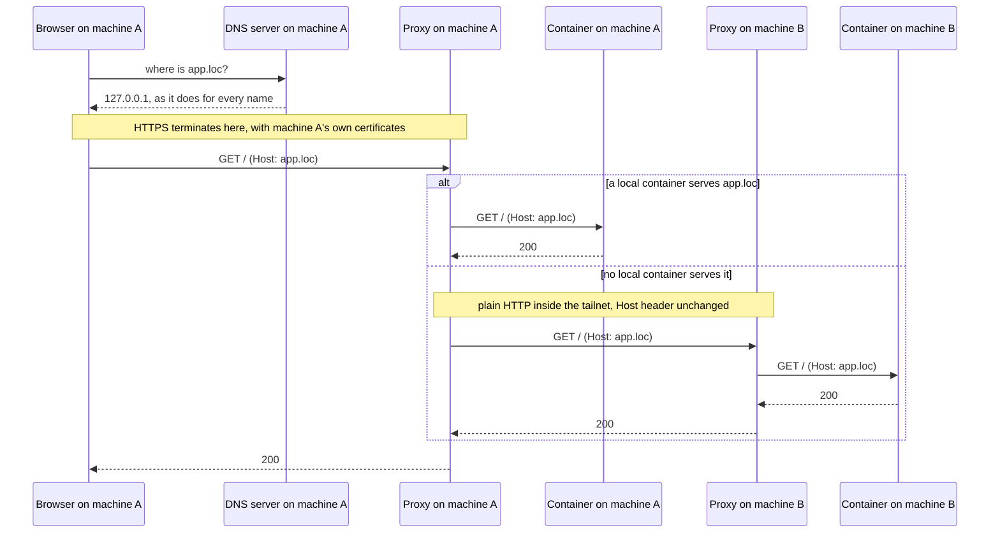
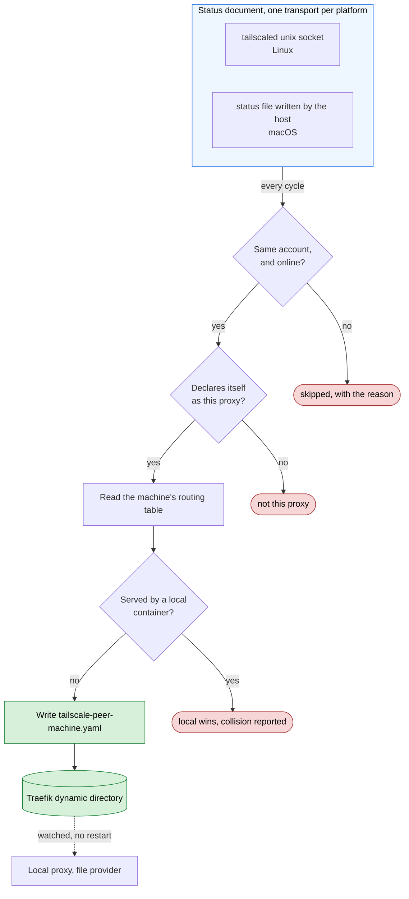
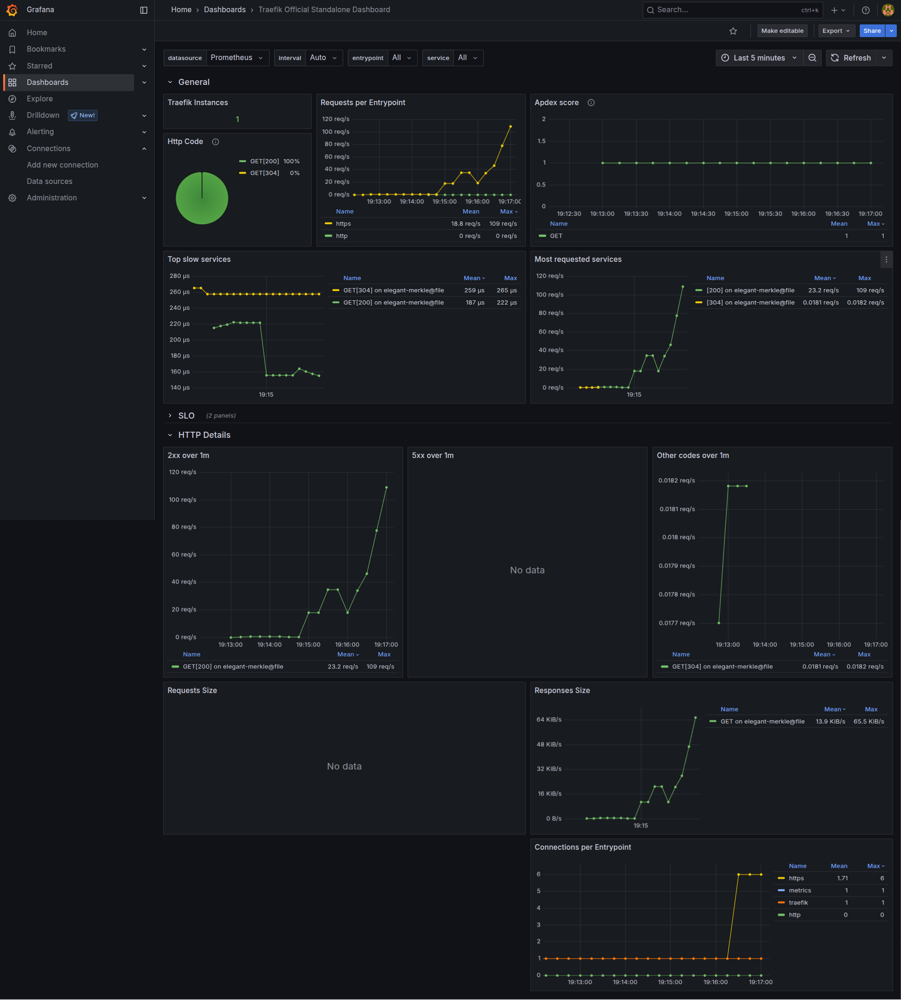
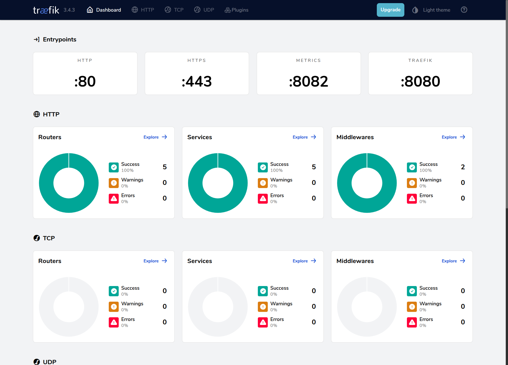

# Spark HTTP Proxy

[](https://ghcr.io/sparkfabrik/http-proxy)
[](https://github.com/sparkfabrik/http-proxy/actions/workflows/ci.yml)
[](https://deepwiki.com/sparkfabrik/http-proxy)

**Automatic HTTP routing for Docker containers** — A Traefik-based proxy that gives your containers clean domain names like `myapp.local` instead of dealing with `localhost:8080` port chaos.

Simply add `VIRTUAL_HOST=myapp.local` to any container or use native Traefik labels, and your applications become accessible with both HTTP and HTTPS automatically. No port management, no `/etc/hosts` editing, no hunting for the right port number. **Only explicitly configured containers are exposed**, keeping your development environment secure by default.

> **Using an AI coding agent?** There is a `spark-http-proxy` agent skill that
> teaches agents to expose containers, generate certificates, configure DNS, and
> troubleshoot routing with this proxy:
> [sparkfabrik/sf-agents-harness → skills/system/spark-http-proxy](https://github.com/sparkfabrik/sf-agents-harness/tree/main/skills/system/spark-http-proxy).

## Table of Contents

- [Features](#features)
- [Quick Start](#quick-start)
  - [Optional Commands](#optional-commands)
- [Container Configuration](#container-configuration)
  - [Supported Patterns](#supported-patterns)
  - [Sharing one domain with VIRTUAL_PATH](#sharing-one-domain-with-virtual_path)
- [Container Management](#container-management)
- [Network Management](#network-management)
- [DNS Server](#dns-server)
  - [DNS Configuration](#dns-configuration)
  - [DNS Usage Patterns](#dns-usage-patterns)
    - [TLD Support (Recommended)](#tld-support-recommended)
    - [Multiple TLDs](#multiple-tlds)
    - [Specific Domains](#specific-domains)
- [Advanced Configuration with Traefik Labels](#advanced-configuration-with-traefik-labels)
  - [Basic Traefik Labels Example](#basic-traefik-labels-example)
  - [Traefik Labels Breakdown](#traefik-labels-breakdown)
  - [Understanding Traefik Core Concepts](#understanding-traefik-core-concepts)
    - [Entrypoints - The "Front Door"](#entrypoints---the-front-door)
    - [Load Balancer - The "Traffic Director"](#load-balancer---the-traffic-director)
    - [The Complete Flow](#the-complete-flow)
    - [Advanced Load Balancer Features](#advanced-load-balancer-features)
    - [Why This Architecture Matters](#why-this-architecture-matters)
- [HTTPS Support](#https-support)
  - [Automatic HTTP and HTTPS Routes](#automatic-http-and-https-routes)
  - [Self-Signed Certificates](#self-signed-certificates)
  - [Trusted Local Certificates with mkcert](#trusted-local-certificates-with-mkcert)
    - [Listing and Removing Certificates](#listing-and-removing-certificates)
    - [Manual Certificate Generation (Alternative)](#manual-certificate-generation-alternative)
    - [Start the proxy](#start-the-proxy)
    - [How Certificate Matching Works](#how-certificate-matching-works)
  - [Using Traefik Labels Instead of VIRTUAL_HOST](#using-traefik-labels-instead-of-virtual_host)
- [Dinghy Layer Compatibility](#dinghy-layer-compatibility)
  - [Supported Environment Variables](#supported-environment-variables)
  - [Borrowed from nginx-proxy](#borrowed-from-nginx-proxy)
  - [Migration Notes](#migration-notes)
- [DNS Server](#dns-server-1)
  - [DNS Configuration](#dns-configuration-1)
  - [DNS Usage Patterns](#dns-usage-patterns-1)
    - [TLD Support (Recommended)](#tld-support-recommended-1)
    - [Multiple TLDs](#multiple-tlds-1)
    - [Specific Domains](#specific-domains-1)
  - [System DNS Configuration](#system-dns-configuration)
    - [Linux (systemd-resolved)](#linux-systemd-resolved)
    - [macOS](#macos)
    - [Manual Testing](#manual-testing)
- [Tailnet Peer Routing](#tailnet-peer-routing)
  - [What it does](#what-it-does)
  - [Using it](#using-it)
  - [Enabling it](#enabling-it)
  - [macOS status document](#macos-status-document)
  - [Seeing what was found](#seeing-what-was-found)
  - [What enabling it exposes](#what-enabling-it-exposes)
- [Metrics & Monitoring](#metrics--monitoring)
  - [Grafana Dashboard](#grafana-dashboard)
  - [Traefik Dashboard](#traefik-dashboard)

## Features

- 🚀 **Automatic Container Discovery** - Zero-configuration HTTP routing for containers with `VIRTUAL_HOST` environment variables or Traefik labels
- 🌐 **Built-in DNS Server** - Resolves custom domains (`.loc`, `.dev`, etc.) to localhost, eliminating manual `/etc/hosts` editing
- 🌍 **Dynamic Network Management** - Automatically joins Docker networks containing manageable containers for seamless routing
- 🔐 **Automatic HTTPS Support** - Provides both HTTP and HTTPS routes with auto-generated certificates and mkcert integration for trusted local certificates
- 🕸️ **Tailnet Peer Routing** - Optional: a hostname served by a container on one of your machines is reachable, under the same name, from your other machines on the same Tailscale tailnet
- 📊 **Monitoring Ready** - Optional Prometheus metrics and Grafana dashboards for traffic monitoring and performance analysis

> **Note**: We thank the [codekitchen/dinghy-http-proxy](https://github.com/codekitchen/dinghy-http-proxy) project for the inspiration and for serving us well over the years. Spark HTTP Proxy includes a compatibility layer that supports the `VIRTUAL_HOST` and `VIRTUAL_PORT` environment variables from the original project, while providing enhanced functionality for broader use cases and improved maintainability.

## Quick Start

```bash
# Install Spark HTTP Proxy
mkdir -p ${HOME}/.local/spark/http-proxy
git clone git@github.com:sparkfabrik/http-proxy.git ${HOME}/.local/spark/http-proxy/src
sudo ln -s ${HOME}/.local/spark/http-proxy/src/bin/spark-http-proxy /usr/local/bin/spark-http-proxy
sudo chmod +x /usr/local/bin/spark-http-proxy
spark-http-proxy install-completion

# Or alternatively if you like to live on the edge.
bash <(curl -fsSL https://raw.githubusercontent.com/sparkfabrik/http-proxy/main/bin/install.sh)

# Start the HTTP proxy
spark-http-proxy start

# Generate trusted SSL certificates
# Option 1: Wildcard certificate (covers nginx.spark.loc, api.spark.loc, etc.)
spark-http-proxy generate-mkcert "*.spark.loc"

# Option 2: Specific certificate (covers only nginx.spark.loc)
spark-http-proxy generate-mkcert "nginx.spark.loc"

# Run an nginx container
docker run -d -e VIRTUAL_HOST=nginx.spark.loc nginx

# Access your app with HTTPS
curl https://nginx.spark.loc
```

**That's it!** 🎉 Your nginx container is now accessible at `https://nginx.spark.loc` with a trusted certificate.

### Certificate Generation

When generating certificates, you can choose between specific domains or wildcards:

- **Specific certificate**: `spark-http-proxy generate-mkcert "nginx.spark.loc"` - covers only `nginx.spark.loc`
- **Wildcard certificate**: `spark-http-proxy generate-mkcert "*.spark.loc"` - covers `nginx.spark.loc`, `api.spark.loc`, etc.

**⚠️ Important**: Wildcard certificates have nesting limitations. A certificate for `*.spark.loc` will NOT work for nested domains like `test.foo.spark.loc`. To match nested domains, you need to generate a more specific wildcard like `*.foo.spark.loc`.

### Optional Commands

```bash
# Configure system DNS (eliminates need for manual /etc/hosts editing)
spark-http-proxy configure-dns

# View status and dashboard
spark-http-proxy status

# Start with monitoring (Prometheus + Grafana)
spark-http-proxy start-with-metrics
```

For more examples and advanced configurations, check the `examples/` directory.

## Container Configuration

**Important**: Only containers with explicit configuration are automatically managed by the proxy. Containers without `VIRTUAL_HOST` environment variables or `traefik.*` labels are ignored to ensure security and prevent unintended exposure.

### Advanced Configuration Examples

For more complex scenarios beyond the Quick Start examples:

```yaml
# docker-compose.yml
services:
  myapp:
    image: nginx:alpine
    environment:
      - VIRTUAL_HOST=myapp.local # Required: your custom domain
      - VIRTUAL_PORT=8080 # Optional: defaults to exposed port or 80
      - VIRTUAL_PATH=/api # Optional: mount under a path of VIRTUAL_HOST
    expose:
      - "8080"
```

### Supported Patterns

`VIRTUAL_HOST` accepts several forms:

- **Single domain**: `VIRTUAL_HOST=myapp.local`
- **Multiple domains**: `VIRTUAL_HOST=app.local,api.local`
- **Wildcards**: `VIRTUAL_HOST=*.myapp.local`
- **Regex patterns**: `VIRTUAL_HOST=~^api\\..*\\.local$`

`VIRTUAL_PATH` is a separate variable, not another host form. It mounts the
container under a path of the hostname `VIRTUAL_HOST` names, so two containers
can share one domain.

### Sharing one domain with VIRTUAL_PATH

A browser-served frontend and its API often need to be on one origin: same
domain, so no CORS, no preflight, and one certificate. Point both containers at
the same `VIRTUAL_HOST` and give the second a `VIRTUAL_PATH`:

```yaml
# docker-compose.yml
services:
  frontend:
    image: node:22-alpine
    environment:
      - VIRTUAL_HOST=myapp.local
      - VIRTUAL_PORT=5173

  api:
    image: node:22-alpine
    environment:
      - VIRTUAL_HOST=myapp.local # the same domain
      - VIRTUAL_PATH=/api # mounted under it
      - VIRTUAL_PORT=3000
```

`http://myapp.local/` reaches the frontend and `http://myapp.local/api/...`
reaches the API, so the page can call `/api/...` with no host in front of it.

What to know before using it:

- **`/api` matches `/api` and everything under it, never `/api-docs`.** Matching
  is by path segment, so a mount cannot capture a sibling that merely starts
  with the same characters.
- **Nothing is stripped.** The API receives `/api/users`, not `/users`, so it
  has to serve the prefix itself. `VIRTUAL_DEST` is not supported.
- **A certificate covers the hostname**, so a mounted path needs none of its
  own and is served by the certificate of the domain it sits on.
- **`VIRTUAL_PORT` belongs to the container.** Each container has its own,
  independently of the others sharing the domain.
- **`VIRTUAL_PATH` applies to every domain the container names.** With
  `VIRTUAL_HOST=a.local,b.local` the container is mounted at that path on both.
- **A `traefik.*` label disables both variables.** A container carrying any
  `traefik.` label is handled by Traefik's Docker provider instead, so its
  `VIRTUAL_HOST` and `VIRTUAL_PATH` are ignored entirely.
- **Stopping the mounted container does not produce a 404.** Its routes go with
  it and its paths fall through to whichever container serves the domain, which
  for a dev server usually means a page and a `200`.
- **Changing the value needs the container recreated**, since environment
  variables cannot be changed in place.

## Container Management

The proxy uses **opt-in container discovery** (`exposedByDefault: false`). Only containers with explicit configuration are managed:

- **Dinghy**: Containers with `VIRTUAL_HOST=domain.local` environment variable
- **Traefik**: Containers with labels starting with `traefik.*`

Unmanaged containers are ignored and never exposed.

One-off containers created by `docker compose run` are also ignored, even when they inherit `VIRTUAL_HOST` from the service definition. They are labelled `com.docker.compose.oneoff=True` by Compose, and routing them would let a short-lived container claim the domain of the long-running service. Use `docker compose up` for containers that must be reachable through the proxy.

## Network Management

The proxy automatically joins Docker networks that contain manageable containers, enabling seamless routing without manual network configuration. This process is handled by the `join-networks` service.

📖 **[Detailed Network Joining Flow Documentation](docs/network-joining-flow.md)** - Complete technical documentation with flow diagrams explaining how automatic network discovery and joining works.

## DNS Server

The HTTP proxy includes a **built-in DNS server** that automatically resolves configured domains to localhost, eliminating the need to manually edit `/etc/hosts` or configure system DNS.

### DNS Configuration

The DNS server supports both **Top-Level Domains (TLDs)** and **specific domains**:

```yaml
# docker-compose.yml
services:
  dns:
    environment:
      # Configure which domains to handle (comma-separated)
      - HTTP_PROXY_DNS_TLDS=loc,dev # Handle any *.loc and *.dev domains
      - HTTP_PROXY_DNS_TLDS=spark.loc,api.dev # Handle only specific domains
      - HTTP_PROXY_DNS_TLDS=loc # Handle any *.loc domains (default)

      # Where to resolve domains (default: 127.0.0.1)
      - HTTP_PROXY_DNS_TARGET_IP=127.0.0.1

      # DNS server port (default: 19322)
      - HTTP_PROXY_DNS_PORT=19322
```

### DNS Usage Patterns

#### TLD Support (Recommended)

Configure TLDs to handle any subdomain automatically:

```bash
# Environment: HTTP_PROXY_DNS_TLDS=loc
✅ myapp.loc → 127.0.0.1
✅ api.loc → 127.0.0.1
✅ anything.loc → 127.0.0.1
❌ myapp.dev → Not handled
```

#### Multiple TLDs

Support multiple development TLDs:

```bash
# Environment: HTTP_PROXY_DNS_TLDS=loc,dev,docker
✅ myapp.loc → 127.0.0.1
✅ api.dev → 127.0.0.1
✅ service.docker → 127.0.0.1
```

#### Specific Domains

Handle only specific domains for precise control:

```bash
# Environment: HTTP_PROXY_DNS_TLDS=spark.loc,api.dev
✅ spark.loc → 127.0.0.1
✅ api.dev → 127.0.0.1
❌ other.loc → Not handled
❌ different.dev → Not handled
```

## Advanced Configuration with Traefik Labels

While `VIRTUAL_HOST` environment variables provide simple automatic routing, you can also use **Traefik labels** for more advanced configuration. Both methods work together seamlessly.

### Basic Traefik Labels Example

```yaml
services:
  myapp:
    image: nginx:alpine
    labels:
      # Define the routing rule - which domain/path routes to this service
      - "traefik.http.routers.myapp.rule=Host(`myapp.docker`)"

      # Specify which entrypoint to use (http = port 80)
      - "traefik.http.routers.myapp.entrypoints=http"

      # Set the target port for load balancing
      - "traefik.http.services.myapp.loadbalancer.server.port=80"
```

> **Note**: `traefik.enable=true` is **not required** since auto-discovery is always enabled in this proxy.

### Traefik Labels Breakdown

| Label            | Purpose                                      | Example                                                     |
| ---------------- | -------------------------------------------- | ----------------------------------------------------------- |
| **Router Rule**  | Defines which requests route to this service | `traefik.http.routers.myapp.rule=Host(\`myapp.docker\`)`    |
| **Entrypoints**  | Which proxy port to listen on                | `traefik.http.routers.myapp.entrypoints=http`               |
| **Service Port** | Target port on the container                 | `traefik.http.services.myapp.loadbalancer.server.port=8080` |

### Understanding Traefik Core Concepts

To effectively use Traefik labels, it helps to understand the key concepts:

#### **Entrypoints** - The "Front Door"

An **entrypoint** is where Traefik listens for incoming traffic. Think of it as the "front door" of your proxy.

```yaml
# In our Traefik configuration:
entrypoints:
  http: # ← This is just a custom name! You can call it anything
    address: ":80" # Listen on port 80 for HTTP traffic
  websecure: # ← Another custom name
    address: ":443" # Listen on port 443 for HTTPS traffic (if configured)
  api: # ← You could even call it "api" or "http" or "frontend"
    address: ":8080" # Listen on port 8080
```

**Important**: `http` is just a **custom name** that we chose. You could name your entrypoints anything:

- `http`, `https`, `frontend`, `api`, `public` - whatever makes sense to you!

When you specify `traefik.http.routers.myapp.entrypoints=http`, you're telling Traefik:

> _"Route requests that come through the entrypoint named 'http' (which happens to be port 80) to my application"_

The entrypoint name must match between:

1. **Traefik configuration** (where you define `web: address: ":80"`)
2. **Container labels** (where you reference `entrypoints=web`)

#### **Load Balancer** - The "Traffic Director"

The **load balancer** determines how traffic gets distributed to your actual application containers.

```yaml
# This label creates a load balancer configuration:
- "traefik.http.services.myapp.loadbalancer.server.port=8080"
```

This tells Traefik:

> _"When routing to this service, send traffic to port 8080 on the container"_

#### **The Complete Flow**

Here's how a request flows through Traefik:

```
1. [Browser] → http://myapp.docker
                    ↓
2. [Entrypoint :80] ← "web" entrypoint receives the request
                    ↓
3. [Router] ← Checks rule: Host(`myapp.docker`) ✓ Match!
                    ↓
4. [Service] ← Routes to the configured service
                    ↓
5. [Load Balancer] ← Forwards to container port 8080
                    ↓
6. [Container] ← Your app receives the request
```

#### **Advanced Load Balancer Features**

While we typically use simple port mapping, Traefik's load balancer supports much more:

```yaml
services:
  # Multiple container instances (automatic load balancing)
  web-app:
    image: nginx:alpine
    deploy:
      replicas: 3 # 3 instances of the same app
    labels:
      - "traefik.http.routers.webapp.rule=Host(`webapp.docker`)"
      - "traefik.http.routers.webapp.entrypoints=web"
      # Traefik automatically balances between all 3 instances!

  # Health check configuration
  api-service:
    image: myapi:latest
    labels:
      - "traefik.http.routers.api.rule=Host(`api.docker`)"
      - "traefik.http.routers.api.entrypoints=web"
      - "traefik.http.services.api.loadbalancer.server.port=3000"
      # Configure health checks
      - "traefik.http.services.api.loadbalancer.healthcheck.path=/health"
      - "traefik.http.services.api.loadbalancer.healthcheck.interval=30s"
```

#### **Why This Architecture Matters**

This separation of concerns provides powerful flexibility:

- **Entrypoints**: Control _where_ Traefik listens (ports, protocols)
- **Routers**: Control _which_ requests go _where_ (domains, paths, headers)
- **Services**: Control _how_ traffic reaches your apps (ports, health checks, load balancing)

Example of advanced routing:

```yaml
services:
  # Same app, different routing based on subdomain
  app-v1:
    image: myapp:v1
    labels:
      - "traefik.http.routers.app-v1.rule=Host(`v1.myapp.docker`)"
      - "traefik.http.routers.app-v1.entrypoints=web"
      - "traefik.http.services.app-v1.loadbalancer.server.port=8080"

  app-v2:
    image: myapp:v2
    labels:
      - "traefik.http.routers.app-v2.rule=Host(`v2.myapp.docker`)"
      - "traefik.http.routers.app-v2.entrypoints=web"
      - "traefik.http.services.app-v2.loadbalancer.server.port=8080"

  # Route 90% traffic to v1, 10% to v2 (canary deployment)
  app-main:
    image: myapp:v1
    labels:
      - "traefik.http.routers.app-main.rule=Host(`myapp.docker`)"
      - "traefik.http.routers.app-main.entrypoints=web"
      - "traefik.http.services.app-main.loadbalancer.server.port=8080"
      # Weight-based routing (advanced feature)
      - "traefik.http.services.app-main.loadbalancer.server.weight=90"
```

## HTTPS Support

The proxy automatically exposes both HTTP and HTTPS for all applications configured with `VIRTUAL_HOST`. Both protocols are available without any additional configuration.

### Automatic HTTP and HTTPS Routes

When you set `VIRTUAL_HOST=myapp.local`, you automatically get:

- **HTTP**: `http://myapp.local` (port 80)
- **HTTPS**: `https://myapp.local` (port 443)

```yaml
services:
  myapp:
    image: nginx:alpine
    environment:
      - VIRTUAL_HOST=myapp.local # Creates both HTTP and HTTPS routes automatically
```

### Self-Signed Certificates

Traefik automatically generates self-signed certificates for HTTPS routes. For trusted certificates in development, you can use mkcert to generate wildcard certificates.

### HSTS Headers Disabled for Development

**HTTP Strict Transport Security (HSTS) headers are automatically disabled** for all HTTPS traffic at the entrypoint level to prevent browser caching issues during development. This ensures that:

- Browsers won't remember HTTPS requirements if certificates are changed or revoked
- Switching between different development setups remains seamless
- Certificate issues don't persist in browser cache and block access

This is implemented using Traefik's `disable-hsts` middleware applied to the HTTPS entrypoint, ensuring **all HTTPS traffic** (both dinghy-layer and native Traefik routes) benefits from this development-friendly configuration. This is essential for development environments where certificates may frequently change, expire, or be regenerated.

### Trusted Local Certificates with mkcert

For browser-trusted certificates without warnings, use the `spark-http-proxy generate-mkcert` command. This command automatically handles the entire certificate generation process:

```bash
# Generate wildcard certificate for .loc domains
spark-http-proxy generate-mkcert "*.loc"

# Generate certificates for specific domains
spark-http-proxy generate-mkcert "myapp.local"

# For complex multi-level domains, generate additional certificates:
spark-http-proxy generate-mkcert "*.project.loc"
```

The `generate-mkcert` command automatically:

- **Installs mkcert** if not already available (using Homebrew on macOS)
- **Creates the certificate directory** (`~/.local/spark/http-proxy/certs`)
- **Generates certificates** with safe filenames for wildcard domains
- **Restarts Traefik** to load the new certificates immediately

#### Listing and Removing Certificates

List the certificates currently installed in the certificate directory:

```bash
spark-http-proxy list-certs
```

Remove certificate pairs for one or more domains. This deletes both the `.pem` and `-key.pem` files and restarts Traefik so it stops serving the removed certificates:

```bash
spark-http-proxy remove-cert "nginx.spark.loc"
spark-http-proxy remove-cert "*.spark.loc"
spark-http-proxy remove-cert "nginx.spark.loc" "api.spark.loc" "*.old.loc"
```

Pass the same domains you used with `generate-mkcert`, including wildcards. The command lists every match, reports any domain it cannot find, and asks for a single confirmation before deleting.

#### Manual Certificate Generation (Alternative)

If you prefer to generate certificates manually using [mkcert](https://github.com/FiloSottile/mkcert) directly:

```bash
# Install the local CA
mkcert -install

# Create the certificates directory
mkdir -p ~/.local/spark/http-proxy/certs

# Generate wildcard certificate for .loc domains
mkcert -cert-file ~/.local/spark/http-proxy/certs/wildcard.loc.pem \
       -key-file ~/.local/spark/http-proxy/certs/wildcard.loc-key.pem \
       "*.loc"
```

**Note**: When using manual generation, you'll need to restart the proxy to load new certificates: `docker compose restart`

#### Start the proxy

The certificates will be automatically detected and loaded when you start the proxy:

```bash
docker compose up -d
```

The Traefik container's entrypoint script scans `~/.local/spark/http-proxy/certs/` for certificate files and automatically generates the TLS configuration in `/traefik/dynamic/auto-tls.yml`. You don't need to manually edit any configuration files!

Now your `.loc` domains will use trusted certificates! 🎉

✅ `https://myapp.loc` - Trusted
✅ `https://api.loc` - Trusted
✅ `https://project.loc` - Trusted

**Note**: The `*.loc` certificate covers single-level subdomains. For multi-level domains like `app.project.sparkfabrik.loc`, generate additional certificates as shown in the commented example above.

#### How Certificate Matching Works

Traefik automatically matches certificates to incoming HTTPS requests using **SNI (Server Name Indication)**:

1. **Certificate Detection**: The entrypoint script scans `/traefik/certs` and extracts domain information from each certificate's Subject Alternative Names (SAN)
2. **Automatic Matching**: When a browser requests `https://myapp.loc`, Traefik:

   - Receives the domain name via SNI
   - Looks through available certificates for one that matches `myapp.loc`
   - Finds the `*.loc` wildcard certificate and uses it
   - Serves the HTTPS response with the trusted certificate

3. **Wildcard Coverage**:

   - `*.loc` covers: `myapp.loc`, `api.loc`, `database.loc`
   - `*.loc` does NOT cover: `sub.myapp.loc`, `api.project.loc`
   - For multi-level domains, generate specific certificates like `*.project.loc`

4. **Fallback**: If no matching certificate is found, Traefik generates a self-signed certificate for that domain

You can see which domains each certificate covers in the container logs when it starts up.

### Using Traefik Labels Instead of VIRTUAL_HOST

If you prefer to use Traefik labels instead of `VIRTUAL_HOST`, you can achieve the same HTTP and HTTPS routes manually:

```yaml
services:
  myapp:
    image: nginx:alpine
    labels:
      # HTTP router
      - "traefik.http.routers.myapp.rule=Host(`myapp.local`)"
      - "traefik.http.routers.myapp.entrypoints=http"
      - "traefik.http.routers.myapp.service=myapp"

      # HTTPS router
      - "traefik.http.routers.myapp-tls.rule=Host(`myapp.local`)"
      - "traefik.http.routers.myapp-tls.entrypoints=https"
      - "traefik.http.routers.myapp-tls.tls=true"
      - "traefik.http.routers.myapp-tls.service=myapp"

      # Service configuration
      - "traefik.http.services.myapp.loadbalancer.server.port=80"
```

This manual approach gives you the same result as `VIRTUAL_HOST=myapp.local` but with more control over the configuration.

## Dinghy Layer Compatibility

This HTTP proxy provides compatibility with the original [dinghy-http-proxy](https://github.com/codekitchen/dinghy-http-proxy) environment variables:

### Supported Environment Variables

| Variable       | Support     | Description                      |
| -------------- | ----------- | -------------------------------- |
| `VIRTUAL_HOST` | ✅ **Full** | Automatic HTTP and HTTPS routing |
| `VIRTUAL_PORT` | ✅ **Full** | Backend port configuration       |

### Borrowed from nginx-proxy

`VIRTUAL_PATH` is not a dinghy-http-proxy variable. It comes from
[nginx-proxy](https://github.com/nginx-proxy/nginx-proxy), which uses it for the
same purpose:

| Variable       | Support     | Description                                          |
| -------------- | ----------- | ---------------------------------------------------- |
| `VIRTUAL_PATH` | ✅ **Full** | Mount a container under a path of its `VIRTUAL_HOST` |
| `VIRTUAL_DEST` | ❌ **None** | Rewriting the path before the backend sees it        |

Without `VIRTUAL_DEST` the request reaches the backend unchanged, which matches
both nginx-proxy's own default and how an ingress forwards a path prefix.

### Migration Notes

- **Security**: **`exposedByDefault: false`** ensures only containers with `VIRTUAL_HOST` or `traefik.*` labels are managed
- **HTTPS**: Unlike the original dinghy-http-proxy, HTTPS is automatically enabled for all `VIRTUAL_HOST` entries
- **Multiple domains**: Comma-separated domains in `VIRTUAL_HOST` work the same way
- **Container selection**: Unmanaged containers are completely ignored, preventing accidental exposure

## DNS Server

The HTTP proxy includes a **built-in DNS server** that automatically resolves configured domains to localhost, eliminating the need to manually edit `/etc/hosts` or configure system DNS.

### DNS Configuration

The DNS server supports both **Top-Level Domains (TLDs)** and **specific domains**:

```yaml
# docker-compose.yml
services:
  dns:
    environment:
      # Configure which domains to handle (comma-separated)
      - HTTP_PROXY_DNS_TLDS=loc,dev # Handle any *.loc and *.dev domains
      - HTTP_PROXY_DNS_TLDS=spark.loc,api.dev # Handle only specific domains
      - HTTP_PROXY_DNS_TLDS=loc # Handle any *.loc domains (default)

      # Where to resolve domains (default: 127.0.0.1)
      - HTTP_PROXY_DNS_TARGET_IP=127.0.0.1

      # DNS server port (default: 19322)
      - HTTP_PROXY_DNS_PORT=19322
```

### DNS Usage Patterns

#### TLD Support (Recommended)

Configure TLDs to handle any subdomain automatically:

```bash
# Environment: HTTP_PROXY_DNS_TLDS=loc
✅ myapp.loc → 127.0.0.1
✅ api.loc → 127.0.0.1
✅ anything.loc → 127.0.0.1
❌ myapp.dev → Not handled
```

#### Multiple TLDs

Support multiple development TLDs:

```bash
# Environment: HTTP_PROXY_DNS_TLDS=loc,dev,docker
✅ myapp.loc → 127.0.0.1
✅ api.dev → 127.0.0.1
✅ service.docker → 127.0.0.1
```

#### Specific Domains

Handle only specific domains for precise control:

```bash
# Environment: HTTP_PROXY_DNS_TLDS=spark.loc,api.dev
✅ spark.loc → 127.0.0.1
✅ api.dev → 127.0.0.1
❌ other.loc → Not handled
❌ different.dev → Not handled
```

### System DNS Configuration

To use the built-in DNS server, configure your system to use it for domain resolution:

#### Linux (systemd-resolved)

```bash
# Configure systemd-resolved to use http-proxy DNS for .loc domains
sudo mkdir -p /etc/systemd/resolved.conf.d
sudo tee /etc/systemd/resolved.conf.d/http-proxy.conf > /dev/null <<EOF
[Resolve]
DNS=172.17.0.1:19322
Domains=~loc
EOF

# Restart systemd-resolved to apply changes
sudo systemctl restart systemd-resolved

# Verify configuration
systemd-resolve --status
```

**⚠️ Known Limitation**: systemd-resolved may route some external domain queries to the HTTP proxy DNS server, resulting in `REFUSED` responses in the logs. This doesn't affect functionality - external domains resolve through fallback mechanisms. **Solutions:**

- **Accept current behavior** (recommended): The `REFUSED` responses are correct and harmless
- **See [systemd-resolved limitations documentation](docs/linux-systemd-resolved-issues.md)** for details

#### macOS

```bash
# Configure specific domains (recommended)
sudo mkdir -p /etc/resolver
echo "nameserver 127.0.0.1" | sudo tee /etc/resolver/loc
echo "port 19322" | sudo tee -a /etc/resolver/loc
```

#### Manual Testing

You can test DNS resolution manually without system configuration:

```bash
# Test with dig (UDP - default)
dig @127.0.0.1 -p 19322 myapp.loc

# Test with dig (TCP - useful for Lima and other virtualization environments)
dig @127.0.0.1 -p 19322 +tcp myapp.loc

# Test with nslookup
nslookup myapp.loc 127.0.0.1 19322

# Test with curl (using custom DNS)
curl --dns-servers 127.0.0.1:19322 http://myapp.loc
```

## Tailnet Peer Routing

A developer with more than one machine runs one proxy per machine, and each
proxy only sees its own Docker socket. A container exposed as `app.loc` on the
desktop does not exist as far as the laptop is concerned. Peer routing makes
that hostname mean the same thing on every machine you own.

It is **off by default**, because it changes what a proxy answers for names it
does not serve itself. Read [What enabling it exposes](#what-enabling-it-exposes)
before turning it on.

### What it does

A fourth sidecar service asks the local Tailscale daemon which machines belong
to your account and are online, reads each one's routing table from the Traefik
API it already publishes on port 30000, and writes Traefik configuration
forwarding any hostname it does not serve locally to `http://<peer>:80` with the
`Host` header preserved.

- **Nothing new is installed on the other machine.** Running the proxy there is
  enough to be discoverable.
- **DNS does not change.** Every machine still answers `127.0.0.1`, and the
  local proxy decides whether a request is served here or forwarded.
- **A local container always wins.** A hostname served locally is answered
  locally and never forwarded, and the collision is reported.
- **Encryption terminates locally**, with the certificates already installed on
  the machine the browser is talking to. No certificate authority is shared
  between machines, and the hop between machines travels inside WireGuard. The
  consequence is that this machine needs a certificate covering a hostname it
  does not itself serve. A wildcard covers one label level, so `*.spark.loc`
  covers `app.spark.loc` but not `app.client.spark.loc`, and a forwarded
  hostname outside the wildcard you hold produces a browser warning until you
  run `spark-http-proxy generate-mkcert` for it. Improving this is tracked in
  [#118](https://github.com/sparkfabrik/http-proxy/issues/118).
- **Only your own machines are used.** A machine is used when the Tailscale
  status document says it belongs to the same account as this one. That check
  runs on every cycle, over the same document whatever platform produced it, and
  no setting turns it off or widens it.
- **A forwarded hostname is never forwarded onward**, so two machines cannot
  bounce a request between them.
- **Only this proxy is adopted.** Port 30000 identifies a Traefik, and a tailnet
  may carry an unrelated one. Every Spark HTTP Proxy publishes a declaration of
  itself, and a machine whose declaration is absent contributes nothing. The
  check fails closed, so **both machines need this version or newer before
  anything is forwarded**.

#### How a request finds the right machine


```mermaid
sequenceDiagram
    participant B as Browser on machine A
    participant D as DNS server on machine A
    participant PA as Proxy on machine A
    participant CA as Container on machine A
    participant PB as Proxy on machine B
    participant CB as Container on machine B

    B->>D: where is app.loc?
    D-->>B: 127.0.0.1, as it does for every name
    Note over B,PA: HTTPS terminates here, with machine A's own certificates
    B->>PA: GET / (Host: app.loc)

    alt a local container serves app.loc
        PA->>CA: GET / (Host: app.loc)
        CA-->>PA: 200
    else no local container serves it
        Note over PA,PB: plain HTTP inside the tailnet, Host header unchanged
        PA->>PB: GET / (Host: app.loc)
        PB->>CB: GET / (Host: app.loc)
        CB-->>PB: 200
        PB-->>PA: 200
    end

    PA-->>B: 200
```

**Reading the diagram.** The browser always talks to its own machine's proxy, because DNS answers `127.0.0.1` for every name it handles, including names this machine knows nothing about. Solid arrows are requests, dashed arrows are responses. The `alt` block is the precedence rule: a local container answers when there is one, and only otherwise does the request leave the machine. The two notes mark the properties that are otherwise invisible: HTTPS terminates on the machine the browser is talking to, and the `Host` header crosses the tailnet unchanged, so the second machine's proxy performs the final match itself.

#### How the routes get there

The request path above reads configuration that a separate loop writes. They are different stories at different speeds, and conflating them is what makes the timing confusing.


```mermaid
graph TB
    subgraph sources["Status document, one transport per platform"]
        direction LR
        sock["tailscaled unix socket<br/>Linux"]
        file["status file written by the host<br/>macOS"]
    end

    own{"Same account,<br/>and online?"}
    declares{"Declares itself<br/>as this proxy?"}
    read["Read the machine's routing table"]
    local{"Served by a local<br/>container?"}
    write["Write tailscale-peer-machine.yaml"]
    dyn[("Traefik dynamic directory")]
    proxy["Local proxy, file provider"]

    skipped(["skipped, with the reason"])
    foreign(["not this proxy"])
    collision(["local wins, collision reported"])

    sources -->|"every cycle"| own
    own -->|"no"| skipped
    own -->|"yes"| declares
    declares -->|"no"| foreign
    declares -->|"yes"| read
    read --> local
    local -->|"yes"| collision
    local -->|"no"| write
    write --> dyn
    dyn -.->|"watched, no restart"| proxy

    classDef reject fill:#f6d6d6,stroke:#a33,color:#000
    classDef accept fill:#d6f0d9,stroke:#1a7f37,color:#000
    class skipped,foreign,collision reject
    class write,dyn accept
    style sources fill:#eef6ff,stroke:#1f6feb,color:#000
```

**Reading the diagram.** The blue group is the status document, and the single arrow leaving it means either transport feeds the same filter: the platform decides how the document arrives, never what it is checked against. Diamonds are decisions, red rounded boxes are the three ways a machine contributes nothing, and they are the three statuses `tailscale-peers` reports. Green is what gets written and where. The dotted edge is the seam with the diagram above: the cycle writes a file, the proxy watches the directory, and nothing restarts.

**How long it takes.** A hostname appearing on another machine becomes reachable on the next cycle, so up to a minute by default, and the same again for one to disappear after it stops being served. Change it with `HTTP_PROXY_TAILSCALE_REFRESH_INTERVAL`. A cycle is one small request per due machine, so the cost is in how often the tailnet is swept rather than in the sweep itself.

### Using it

Start the proxy with peer routing on, the same way you would start it with
monitoring:

```bash
spark-http-proxy start-with-tailscale
```

Do the same on your other machine. Nothing else is configured: no peer list, no
addresses, no changes to any project.

**On macOS there is one extra step.** The macOS Tailscale build exposes no unix
socket a container can mount, so the host writes the status document instead:

```bash
HTTP_PROXY_TAILSCALE_SOURCE=file spark-http-proxy start-with-tailscale
```

`start-with-tailscale` writes that document once. Keep it current with a
scheduled job running one command, otherwise discovery goes stale and stops
adopting peers:

```bash
spark-http-proxy tailscale-status
```

**See what was found.** This reports the proxy's most recent cycle rather than
going looking itself:

```console
$ spark-http-proxy tailscale-peers
Tailnet peers, from the cycle at 2026-01-02T09:15:04Z
Source: socket, tailnet status produced at 2026-01-02T09:15:04Z

MACHINE     ADDRESS         STATUS       DETAIL
machine-a   100.100.0.11    ok           app.loc, api.loc
machine-b   100.100.0.12    not this proxy  answered, but does not declare itself
router      100.100.0.20    unreachable  connection refused
tv          100.100.0.31    skipped      offline
phone       100.100.0.32    skipped      offline

5 machines considered, 1 machine forwarding 2 hostnames.
1 machine did not answer as a proxy, which is usual on a tailnet carrying phones, routers and the like.
1 machine answered but did not declare itself as this proxy, so its routes were not used.
2 machines excluded, with the reason in the table.
```

Most rows on a real tailnet are phones, routers and televisions. They are
expected, not a fault. Add `--json` for the same information machine-readably.

**Turn it off again** without stopping the proxy:

```bash
spark-http-proxy stop-tailscale
```

That stops **this machine forwarding to others**. Every hostname it was forwarding is withdrawn immediately and the machine keeps serving its own containers.

It does not withdraw this machine from the tailnet. Its proxy still runs, still publishes the declaration that says what it is, and still answers for its own containers, so your other machines keep discovering and reaching it. To stop that, stop the proxy itself or close the ports.

### Enabling it

```bash
HTTP_PROXY_TAILSCALE_ENABLED=true spark-http-proxy start
```

Do the same on the other machine, and their hostnames become mutually reachable.
Disabling it and restarting removes every forwarded hostname.

| Variable                                | Default                              | Meaning                                                                           |
| --------------------------------------- | ------------------------------------ | --------------------------------------------------------------------------------- |
| `HTTP_PROXY_TAILSCALE_ENABLED`          | `false`                              | Turns the behaviour on                                                            |
| `HTTP_PROXY_TAILSCALE_SOURCE`           | `socket`                             | Where the tailnet status document comes from: `socket` or `file`                  |
| `HTTP_PROXY_TAILSCALE_REFRESH_INTERVAL` | `60s`                                | How often peers are re-read                                                       |
| `HTTP_PROXY_TAILSCALE_STATUS_MAX_AGE`   | `10m`                                | How old a host-written status document may be before it is treated as no document |
| `HTTP_PROXY_TAILSCALE_SOCKET`           | `/var/run/tailscale/tailscaled.sock` | The daemon socket, for the `socket` source                                        |
| `HTTP_PROXY_TAILSCALE_STATUS_FILE`      | `/state/tailscale-status.json`       | The status document, for the `file` source                                        |

Discovery is polling, so a container appearing on another machine takes up to
one interval to become reachable. The interval is paced for a background daemon:
the trigger is a person starting a container elsewhere, not a request waiting.

### macOS status document

The macOS Tailscale build exposes no unix socket a container can mount, so the
status document is produced on the host instead. It is the same document, read
by the same filter: this is the same discovery over a different transport, not a
weaker mode.

```bash
HTTP_PROXY_TAILSCALE_ENABLED=true HTTP_PROXY_TAILSCALE_SOURCE=file spark-http-proxy start
```

`start` writes the document. Keeping it current is one command on a schedule:

```bash
spark-http-proxy tailscale-status
```

Schedule that command every 5 minutes. A document older than
`HTTP_PROXY_TAILSCALE_STATUS_MAX_AGE`, 10 minutes by default, is treated as no
document rather than as an empty tailnet, so a machine that stops refreshing it
withdraws its peers instead of forwarding to machines that may have gone away.
That tolerance is deliberately separate from the refresh interval: how fresh the
document must be depends on how often the host writes it, not on how often peers
are polled. The command
finds the Tailscale client on `PATH` first and inside the application bundle
second, which is where it lives on macOS.

`spark-http-proxy` creates that directory, owner only, before starting the stack. Starting the containers with `docker compose` directly instead leaves the service to create it as root, so create it yourself first if you do that.

The document and the report both live in `~/.local/spark/http-proxy/state`. That
directory is a **trust input**: the document in it decides which machines traffic
is forwarded to, so it is created readable and writable by its owner alone. Keep
it that way.

### Seeing what was found

```bash
spark-http-proxy tailscale-peers
spark-http-proxy tailscale-peers --json
```

Every machine discovery considered is listed, including the ones that gave
nothing, with the reason:

| Status        | Meaning                                                        |
| ------------- | -------------------------------------------------------------- |
| `ok`          | probed, and its hostnames are being forwarded                  |
| `no proxy`    | answered, but not with a routing table                         |
| `unreachable` | did not answer within the probe timeout, currently backing off |
| `skipped`     | found on the tailnet but excluded, with the reason given       |

Most machines on a tailnet are phones, routers and televisions, so `unreachable`
and `no proxy` rows are the ordinary case rather than a fault. The command
reports the proxy's most recent cycle rather than performing discovery of its
own, so it cannot disagree with what the proxy is doing, and it still answers
when the proxy is stopped, saying that what it shows is not current.

### What enabling it exposes

- **Your local development containers become reachable from your other
  devices.** Those containers usually have no authentication of any kind. This
  is the point of the feature, and it is worth being deliberate about.
- **The proxy's ports are published on all interfaces**, so 80, 443 and 30000
  are reachable from any network the machine is on, not only from the tailnet.
  That is true today, before enabling anything here, but this feature makes it
  load-bearing. Narrow it by binding the published ports to the tailnet address,
  by editing the `ports:` entries in your compose file, or by firewalling them.
- **A machine is adopted only if it declares itself as this proxy**, so an
  unrelated Traefik on the tailnet is not treated as a source of routes. The
  declaration is not a secret and not an authentication mechanism: anything that
  can reach port 30000 can publish one. It separates this proxy from other
  software, not trusted machines from untrusted ones. What limits forwarding to
  your own machines is the Tailscale account check.
- **The route registry is an unauthenticated read-only API.** Port 30000 is the
  Traefik API, and any device that can reach it can enumerate the project
  hostnames this machine serves. It discloses hostnames and routing rules, not
  request contents.

## Metrics & Monitoring

Monitor your HTTP proxy traffic with built-in Prometheus metrics and Grafana dashboards:

```bash
# Start with monitoring stack (Prometheus + Grafana)
spark-http-proxy start-with-metrics
```

### Grafana Dashboard

Access the pre-configured Grafana dashboard at `http://localhost:3000` (admin/admin):



The dashboard provides insights into:

- Request rates and response times
- HTTP status codes distribution
- Active connections and bandwidth usage
- Container routing statistics

### Traefik Dashboard

Monitor routing rules and service health at `http://localhost:8080`:



The Traefik dashboard shows:

- Active routes and services
- Real-time traffic flow
- Health check status
- Load balancer configuration

Both dashboards are automatically configured and ready to use with no additional setup required.
