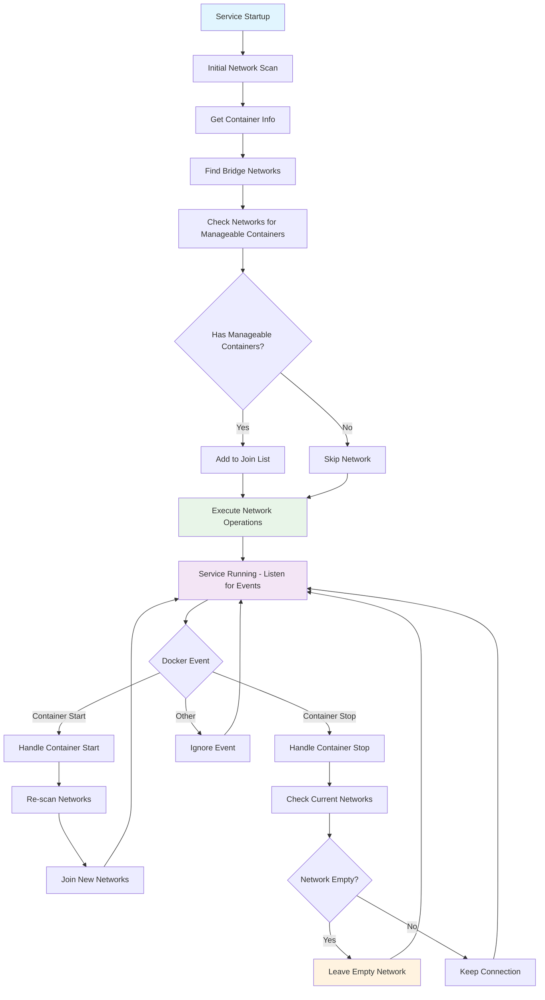
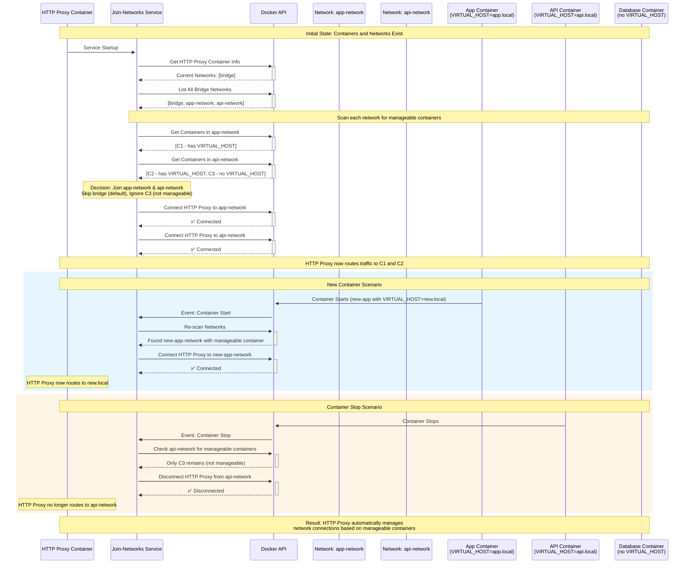
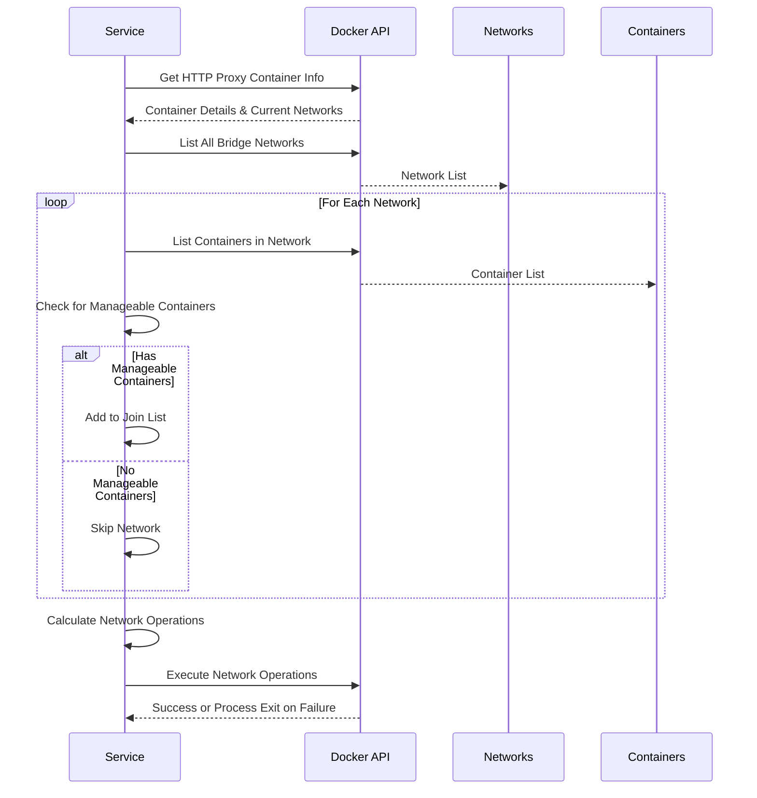
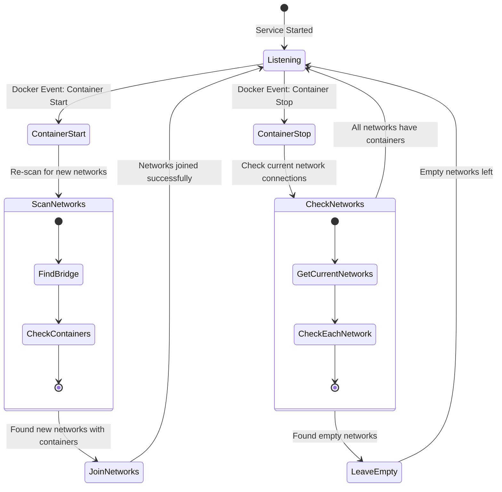
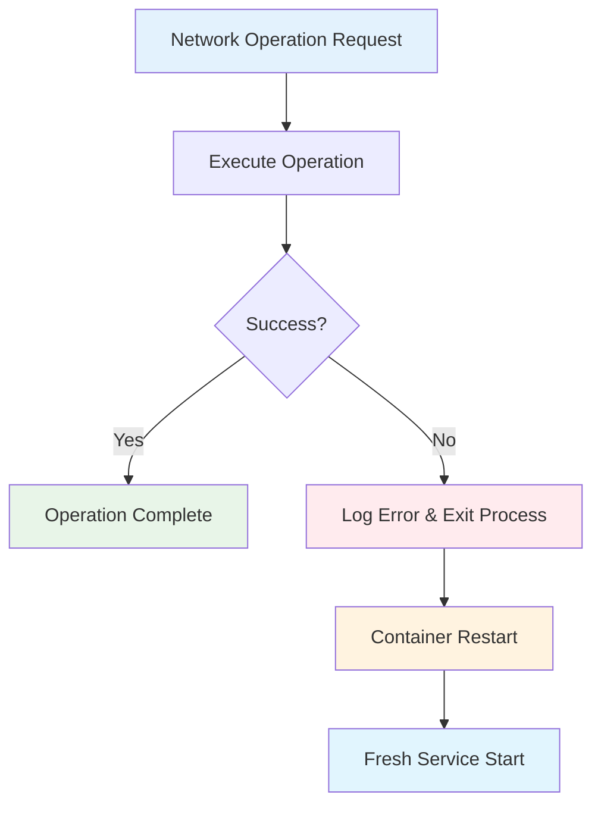

# Network Joining Flow Documentation

This document explains how the `join-networks` service automatically manages Docker network connections for the HTTP proxy container.

## Overview

The `join-networks` service ensures that the HTTP proxy container is automatically connected to all Docker networks that contain manageable containers (containers with `VIRTUAL_HOST` environment variables). This enables automatic routing without manual network configuration.

### Key Concepts

- **HTTP Proxy Container**: The main Traefik container that routes HTTP traffic
- **Manageable Containers**: Any container with `VIRTUAL_HOST` environment variable or Traefik labels
- **Join-Networks Service**: A background service that monitors Docker events and manages network connections
- **Automatic Network Discovery**: The process of scanning Docker networks to find containers that need routing

### How It Works

1. **At Startup**: The service scans all Docker bridge networks and connects the HTTP proxy to networks containing manageable containers
2. **During Runtime**: When containers start/stop, the service automatically joins new networks or leaves empty ones
3. **Security**: Only explicitly configured containers (with `VIRTUAL_HOST` or Traefik labels) are considered for routing
4. **Fail-Fast**: If any network operation fails, the service exits and relies on container restart for recovery

## Architecture Flow

## HTTP Proxy and Container Interactions

This sequence diagram shows how the HTTP proxy container interacts with other containers and networks:

## Detailed Process Flow

### 1. Initial Network Scan

### 2. Event-Driven Network Management

### 3. Simplified Network Operations

## Key Components

### NetworkJoiner Service

- **Purpose**: Manages automatic network joining/leaving for the HTTP proxy
- **Interface**: Implements `service.EventHandler`
- **Configuration**: Uses `NetworkJoinerConfig` with HTTP proxy container name

### Network Discovery Process

1. **Find Bridge Networks**: Lists all Docker bridge networks
2. **Filter Networks**: Excludes default bridge and non-bridge networks
3. **Check for Manageable Containers**: Looks for containers with `VIRTUAL_HOST` env vars or Traefik labels
4. **Calculate Operations**: Determines which networks to join/leave

### Failure Handling Strategy

- **Fail-Fast Approach**: Any network operation failure causes immediate process exit
- **Container Restart**: Relies on Docker/Kubernetes to restart the service automatically
- **Retry Logic**: Built into Docker API calls for transient failures
- **Clean State**: Each restart starts with a fresh scan of the current state

### Event Handling

- **Container Start**: Triggers network re-scan to join new networks
- **Container Stop**: Checks for empty networks that can be safely left
- **Filtering**: Only processes events for manageable containers

## Configuration

The service is configured via command-line flags:

- `--container-name`: Name of the HTTP proxy container (default: "http-proxy")
- `--log-level`: Logging verbosity level (default: "info")

### Internal Configuration Constants

- **Max Retries**: 3 attempts for Docker API operations
- **Retry Delay**: 2-second delay between retry attempts
- **Bridge Driver**: Only processes "bridge" type networks
- **Default Bridge Protection**: Never disconnects from the default Docker bridge network

## Error Handling

The service uses a simplified, fail-fast error handling approach:

- **Network Operation Failures**: Logged and process exits immediately
- **Docker API Errors**: Built-in retry logic with exponential backoff
- **Container Info Errors**: Process exits if critical information cannot be obtained
- **Service Recovery**: Container orchestration handles automatic restart and recovery

## Benefits

1. **Zero Configuration**: Automatically detects and connects to relevant networks
2. **Dynamic Management**: Responds to container lifecycle events in real-time
3. **Safety First**: Multiple safety checks prevent connectivity loss
4. **Efficient**: Only joins networks with manageable containers
5. **Resilient**: Handles failures with fail-fast approach and automatic restart recovery
